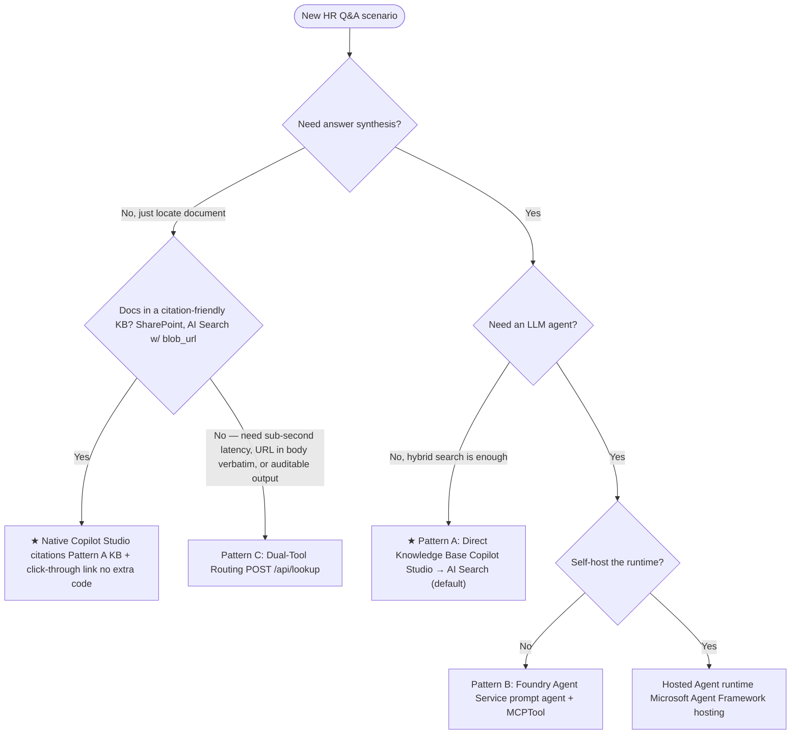

# HR Policy Knowledge Agent

> **⚠️ DISCLAIMER:** This repository is intended for **development, experimentation, and learning purposes only**. It is **not designed for production workloads**. Before deploying any AI-powered solution to production, consult the [Microsoft Azure Well-Architected Framework (WAF)](https://learn.microsoft.com/en-us/azure/well-architected/) and the [Azure AI services security baseline](https://learn.microsoft.com/en-us/security/benchmark/azure/baselines/azure-ai-services-security-baseline) for guidance on reliability, security, cost optimization, operational excellence, and performance efficiency. Production deployments should incorporate proper authentication, monitoring, data governance, content safety filters, and compliance controls aligned to your organization's requirements.

> **Ask HR** — An AI-powered assistant that answers employee questions
> using internal HR policy documents. Built on Azure AI Foundry, Azure
> AI Search, Microsoft Agent Framework (GA), and Copilot Studio.

---

## Where to Start

This repo supports three main paths. Pick the one that matches your scenario:

| # | Path | Start here | What you'll build |
| - | ---- | ---------- | ----------------- |
| 1 | **Copilot Studio alone** (Pattern A) | [docs/Walkthrough.md — Steps 1–3, then Step 7 (Pattern A)](docs/Walkthrough.md) | Copilot Studio queries Azure AI Search directly — no agent code needed. Fastest setup (~15 min after index is populated). |
| 2 | **Foundry Agent alone** (Pattern B) | [docs/Walkthrough.md — Steps 1–5](docs/Walkthrough.md), then test with `python -m scripts.demo.test_pattern_b` | A PromptAgent with MCPTool + `tool_choice="required"` for force-grounded synthesis. No Copilot Studio required for testing. |
| 3 | **Copilot Studio + Foundry Agent** (Patterns A+B or Hybrid) | Complete all steps in [docs/Walkthrough.md](docs/Walkthrough.md), then wire via [docs/CopilotStudioIntegration.md](docs/CopilotStudioIntegration.md) | Copilot Studio as the front door, Foundry Agent as the reasoning backend. Full enterprise pattern. |

> **Not sure which?** Start with **Path 1** (Pattern A). It's zero-code, demonstrates value in minutes, and you can layer Foundry Agent Service on top later without re-indexing.

---

## Decision Tree — Pick a Pattern



> **Q3 is about the runtime, not the front door.** Copilot Studio is
> still the front door for both Pattern B and the Hosted Agent — see
> [Hosted Agent wiring](docs/CopilotStudioIntegration.md#hosted-agent-wiring).
> Q3 chooses whether the agent's request loop runs in Foundry
> (Pattern B, managed) or in your container (Hosted Agent,
> self-hosted).

| Pattern | Code path                                       | Latency  | When                                |
| ------- | ----------------------------------------------- | -------- | ----------------------------------- |
| **A** ★ | Copilot Studio Knowledge Source                 | ~1–2 s   | Start here — simplest setup, no agent code needed |
| **B**   | `src/agents/hr_policy_agent.py` (PromptAgent)   | ~10–14 s | Upgrade for force-grounded answer synthesis |
| **C**   | `src/backend/main.py:/api/lookup`               | ~1–2 s   | Sub-second doc-locator with verbatim URL — only when native citations aren't enough |
| Hosted  | `src/agents/hr_policy_agent_af.py` + container  | ~10–14 s | Self-hosted runtime (Agent Framework hosting, GA) |

★ **Default — start here.** Pattern A connects Copilot Studio directly to
Azure AI Search; no agent code in this repo runs in the answer path. Step
up to Pattern B when you need force-grounded synthesis via
`tool_choice="required"`. Set `AGENT_SERVICE=foundry` and run
`python -m src.agents.create_foundry_agent` to provision Pattern B.

> **Locator queries don't always need Pattern C.** Copilot Studio's
> native knowledge-source citations (SharePoint connector, or Pattern A
> with `blob_url` / `metadata_storage_path` mapped) already give the
> user a click-through link to the source document. Add Pattern C only
> when you need **sub-second latency**, **the URL in the answer body
> verbatim**, **deterministic / auditable output**, or your source
> isn't a citation-friendly KB. See
> [Pattern C vs native citations](docs/CopilotStudioLookupRouting.md#pattern-c-vs-native-citations).

Full details: **[docs/RetrievalPatterns.md](docs/RetrievalPatterns.md)**.
Deep-dive on the default Pattern B internals: **[docs/FoundryAgentArchitecture.md](docs/FoundryAgentArchitecture.md)**.
SDK choice (Foundry Agent Service vs Microsoft Agent Framework): **[docs/AgentArchitecturePaths.md](docs/AgentArchitecturePaths.md)**.
Linear setup steps: **[docs/Walkthrough.md](docs/Walkthrough.md)**.
Lab cross-walk to [Azure/Copilot-Studio-and-Azure](https://github.com/Azure/Copilot-Studio-and-Azure): **[docs/LabCoverage.md](docs/LabCoverage.md)**.

Want to see each pattern run live? **[scripts/demo/README.md](scripts/demo/README.md)** ships a per-pattern test script for A / B / C / Hosted plus a four-act storytelling demo that walks the decision tree end-to-end:

```bash
# Full storytelling walk-through (skip Foundry-only acts if not provisioned)
python -m scripts.demo.demo_decision_tree --skip-b --skip-hosted
```

Ready to wire and test the same patterns inside Copilot Studio? Follow the
step-by-step **[docs/CopilotStudioTestingGuide.md](docs/CopilotStudioTestingGuide.md)** — setup steps for every pattern plus numbered test scenarios you can run from the agent's Test pane.

---

## Walkthrough

### 1. Prerequisites

- Azure subscription with **AI Search**, **AI Foundry**, **OpenAI**, and **Document Intelligence**.
- Azure CLI (`az login`) with the right subscription selected.
- Python 3.10+ and [`uv`](https://docs.astral.sh/uv/).
- Node.js 18+ (only if you run the React frontends).
- Copilot Studio licence (Power Virtual Agents) for Patterns A / C.

### 2. Clone, configure, install

```bash
git clone https://github.com/honestypugh2/foundry-copilot-hr-policy-knowledge.git
cd foundry-copilot-hr-policy-knowledge
uv sync
cp .env.example .env          # Full config (all patterns)
# OR for Pattern A only:
# cp .env.pattern-a.example .env
# Edit .env with your Azure endpoints
```

Key environment variables (see `.env.example`):

```bash
AZURE_AI_PROJECT_ENDPOINT=https://<project>.services.ai.azure.com/api/projects/<project>
AZURE_SEARCH_ENDPOINT=https://<search>.search.windows.net
AZURE_OPENAI_ENDPOINT=https://<openai>.openai.azure.com
AZURE_OPENAI_DEPLOYMENT_NAME=gpt-4o
AGENT_SERVICE=agent-framework  # default. Set to "foundry" only when running Pattern B
ORCHESTRATOR_PATTERN=A         # documentation hint — see docs/RetrievalPatterns.md
SEARCH_MODE=integrated_vectorization
```

### 3. Index the knowledge base

Two options — pick one. Both populate `hr-policy-index`.

```bash
# Option 1 — Client-side chunking (best for dev/test)
uv run python scripts/index_knowledge_base_docintel_chunking.py

# Option 2 — Integrated vectorization (best for production)
uv run python scripts/index_knowledge_base_integrated_vectorization.py
```

Local-only extraction (no Azure upload):

```bash
uv run python scripts/index_knowledge_base_docintel_chunking.py --local-only
```

### 4. (Optional) Provision the Foundry Agent (Pattern B)

Skip this step if you're starting with Pattern A. Run it when you want
force-grounded answer synthesis via `tool_choice="required"`.

```bash
# Preview what will be created (no credentials needed beyond AZURE_SEARCH_ENDPOINT)
uv run python -m src.agents.create_foundry_agent --dry-run

# Create the resources
uv run python -m src.agents.create_foundry_agent
```

Creates: Knowledge Source → Knowledge Base → MCP connection → PromptAgent
(`HRPolicyAgent`, `gpt-4o`, `tool_choice="required"`).

Verify or clean up:

```bash
uv run python -m src.agents.create_foundry_agent --verify-only
uv run python -m src.agents.create_foundry_agent --cleanup
```

### 5. Run the FastAPI backend

```bash
uv run python -m src.backend.main
# http://localhost:8000   (docs at /docs)
```

Endpoints:

| Method | Path                               | Notes                                |
| ------ | ---------------------------------- | ------------------------------------ |
| `POST` | `/api/chat`                        | Pattern B answer synthesis           |
| `POST` | `/api/lookup`                      | Pattern C document locator (no LLM)  |
| `GET`  | `/api/knowledge-base`              | Index metadata                       |
| `POST` | `/api/knowledge-base/reindex`      | Full reindex                         |
| `POST` | `/api/documents/upload`            | Upload + index a single document     |
| `GET`  | `/api/glossary`                    | HR vernacular glossary               |
| `GET`  | `/api/health`                      | Service health                       |
| `GET`  | `/api/azure/status`                | Per-service config status            |
| `GET`  | `/api/copilot-studio/token`        | Direct Line token (web chat embed)   |
| `POST` | `/api/copilot-studio/chat`         | Proxy to Copilot Studio bot          |

### 6. (Optional) Run the React frontends

```bash
# Pure Agent Framework UI
cd src/frontend && npm install && npm run dev          # http://localhost:5173

# Copilot Studio web chat embed
cd src/frontend-copilot-studio && npm install && npm run dev  # http://localhost:5174
```

### 7. Wire up Copilot Studio

| Pattern | Setup guide                                                                |
| ------- | -------------------------------------------------------------------------- |
| A       | [docs/CopilotStudioIntegration.md](docs/CopilotStudioIntegration.md) — *Path 1* |
| B       | [docs/CopilotStudioIntegration.md](docs/CopilotStudioIntegration.md) — *Path 2* |
| C       | [docs/CopilotStudioLookupRouting.md](docs/CopilotStudioLookupRouting.md)   |
| Hybrid  | [docs/CopilotStudioHybridExample.md](docs/CopilotStudioHybridExample.md)   |

OpenAPI specs to import as Custom Connectors in Power Platform:

- `copilot/openapi-lookup-v2.json` — Pattern C (`lookupHRPolicyDocument`)
- `copilot/openapi-v2.json`        — Pattern B (`askHRPolicy`)
- `copilot/quick_reference_guide.md` — paste into the copilot's
  generative AI instructions or attach as a knowledge file (HR
  glossary + policy-number map).

### 8. (Optional) Run the Hosted Agent runtime

```bash
cd src/hosted_agent
uv run python server.py        # http://localhost:8088
# or build the container:
docker build -t hr-policy-hosted-agent .
```

`agent.yaml` declares the agent; `server.py` runs Microsoft Agent
Framework with `FoundryChatClient` and the `@tool search_hr_policies`
function defined in `src/agents/hr_policy_agent_af.py`.

### 9. Run the test suite

```bash
uv run pytest tests/ -v
uv run pytest tests/ -v -m mock     # tests that don't need Azure
```

### 10. Deploy infrastructure

```bash
az deployment group create \
  --resource-group <your-rg> \
  --template-file infra/main.bicep \
  --parameters infra/main.parameters.json
```

---

## Tech Stack

| Component                     | Version (GA where applicable)                               |
| ----------------------------- | ----------------------------------------------------------- |
| Microsoft Agent Framework     | `agent-framework>=1.8.1` (GA)                               |
| Foundry Agent Service SDK     | `azure-ai-projects>=2.2.0` (GA)                             |
| Foundry helpers               | `agent-framework-foundry>=1.8.1` (GA)                       |
| Azure AI Search SDK           | `azure-search-documents>=12.0.0`                            |
| OpenAI SDK                    | `openai>=2.31.0`                                            |
| FastAPI / Pydantic            | `fastapi>=0.135.1`, `pydantic>=2.12.5`                      |
| Frontend                      | React 19, TypeScript 5.8, Vite 6, Tailwind 4                 |
| Hosted Agent (Agent Framework hosting, GA) | `agent-framework>=1.8.1` + alpha `agent-framework-foundry-hosting==1.0.0a*` if deploying into Foundry's hosted-agents preview surface |

---

## Project Structure

```
.
├── src/
│   ├── agents/
│   │   ├── hr_policy_agent.py        # Pattern B: Foundry PromptAgent + MCPTool
│   │   ├── hr_policy_agent_af.py     # Hosted Agent: Microsoft Agent Framework + @tool
│   │   ├── orchestrator.py           # Sequential workflow + AGENT_SERVICE switch
│   │   └── create_foundry_agent.py   # Provision KB, KB Source, MCP connection, PromptAgent
│   ├── backend/main.py               # FastAPI (POST /api/chat, /api/lookup, …)
│   ├── config/                       # search_config.json + typed accessor
│   ├── document_processing/          # Doc Intelligence + chunking
│   ├── search/                       # Hybrid + integrated-vectorization clients
│   ├── copilot_studio/service.py     # Direct-to-Engine API
│   ├── frontend/                     # React 19 + TypeScript chat UI
│   ├── frontend-copilot-studio/      # React 19 + Copilot Studio Web Chat embed
│   └── hosted_agent/                 # agent.yaml + server.py + Dockerfile
├── scripts/                          # Indexing + utilities
│   ├── index_knowledge_base_docintel_chunking.py      # Option 1
│   ├── index_knowledge_base_integrated_vectorization.py # Option 2
│   ├── upload_to_blob.py
│   └── setup.sh
├── copilot/
│   ├── openapi-v2.json               # Pattern B custom connector
│   ├── openapi-lookup-v2.json        # Pattern C custom connector
│   └── quick_reference_guide.md      # HR glossary + policy-number map
├── docs/
│   ├── RetrievalPatterns.md          # Decision tree + Pattern A/B/C/Hosted comparison
│   ├── CopilotStudioIntegration.md   # Patterns A & B in Copilot Studio
│   ├── CopilotStudioLookupRouting.md # Pattern C wiring
│   ├── CopilotStudioHybridExample.md # Combining all three patterns
│   ├── DataPipelineAndTesting.md     # Indexing pipeline + tests
│   └── SharePointLogicAppsArchitecture.md
├── infra/                            # Bicep + Terraform IaC
└── tests/                            # pytest suites
```

---

## Customer Challenges Addressed

| # | Challenge                                            | Solution                                                                 |
| - | ---------------------------------------------------- | ------------------------------------------------------------------------ |
| 1 | Incorrect grounding against authoritative data       | PromptAgent with `tool_choice="required"` + strict citation instructions |
| 2 | Difficulty understanding technician vernacular        | Synonym map + Python glossary expansion (`HR_GLOSSARY`)                  |
| 3 | Managing multiple data sources in a single agent      | KB MCP tool aggregates Knowledge Sources behind one agent                |
| 4 | Prompt and instruction limitations in Copilot Studio | Detailed `AGENT_INSTRUCTIONS` in the backend + dual-tool routing         |

---

## Production Considerations

> **This repo is not production-ready.** It is a learning accelerator and reference implementation. Before promoting any of these patterns to a production environment, address the following:

| Area | What to do | Reference |
| ---- | ---------- | --------- |
| **Security** | Remove API keys from `.env`; use Managed Identity exclusively. Enable network isolation (VNet, Private Endpoints). Add Azure Content Safety filters. | [Azure WAF — Security pillar](https://learn.microsoft.com/en-us/azure/well-architected/security/) |
| **Reliability** | Add retry policies, circuit breakers, health probes, and multi-region failover for AI Search and OpenAI. | [Azure WAF — Reliability pillar](https://learn.microsoft.com/en-us/azure/well-architected/reliability/) |
| **Performance** | Profile latency under load. Use semantic caching (APIM AI Gateway) and right-size SKUs. | [Azure WAF — Performance efficiency](https://learn.microsoft.com/en-us/azure/well-architected/performance-efficiency/) |
| **Cost** | Set token budgets, monitor consumption with Application Insights, rightsize search replicas. | [Azure WAF — Cost optimization](https://learn.microsoft.com/en-us/azure/well-architected/cost-optimization/) |
| **Operations** | Enable structured logging, distributed tracing (OpenTelemetry), and alerts. Use CI/CD for index and agent deployments. | [Azure WAF — Operational excellence](https://learn.microsoft.com/en-us/azure/well-architected/operational-excellence/) |
| **Data governance** | Classify data sensitivity. Implement document-level ACLs in the index. Add PII redaction where required. | [Microsoft Purview](https://learn.microsoft.com/en-us/purview/) |
| **Responsible AI** | Review model outputs for fairness and bias. Add human-in-the-loop where answers affect employment decisions. | [Microsoft Responsible AI](https://www.microsoft.com/en-us/ai/responsible-ai) |

---

## License

See [LICENSE](LICENSE).
