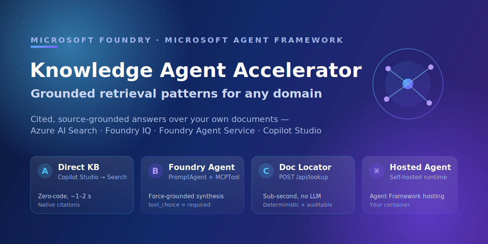
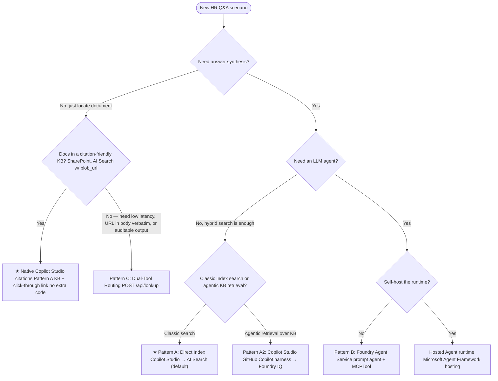

<p align="center">
  
</p>

> **Published-banner terminology:** The banner is retained unchanged to match
> the published article. Its "Direct KB" label means **Pattern A: Direct
> Index**, and "Sub-second, no LLM" should be read as **low-latency, with no
> repo-owned backend model call**. All latency figures are illustrative and
> environment-dependent.

# HR Policy Knowledge Agent

> **⚠️ DISCLAIMER:** This repository is intended for **development, experimentation, and learning purposes only**. It is **not designed for production workloads**. Before deploying any AI-powered solution to production, consult the [Microsoft Azure Well-Architected Framework (WAF)](https://learn.microsoft.com/en-us/azure/well-architected/) and the [Azure AI services security baseline](https://learn.microsoft.com/en-us/security/benchmark/azure/baselines/azure-ai-services-security-baseline) for guidance on reliability, security, cost optimization, operational excellence, and performance efficiency. Production deployments should incorporate proper authentication, monitoring, data governance, content safety filters, and compliance controls aligned to your organization's requirements.

> **Ask HR** — An AI-powered assistant that answers employee questions
> using internal HR policy documents. Built on Microsoft Foundry, Azure
> AI Search, Microsoft Agent Framework (GA), and Copilot Studio.

---

## Where to Start

This repository is the executable companion to
[Grounding Copilot Studio Agents with Azure AI Search and Foundry IQ](https://techcommunity.microsoft.com/blog/azure-ai-foundry-blog/grounding-copilot-studio-agents-with-azure-ai-search-and-foundry-iq/4539337).
The article and repository use the same five pattern names.

**Build one pattern at a time:** start with
[Build the Retrieval Patterns](docs/patterns/README.md). It walks through
Pattern A first, explains its Search and SharePoint options, and then gives one
focused guide each for A2, B, C, and Hosted. Each guide ends with a validation
check and a decision to stop or continue.

Use [Pattern Setup, Code Ownership, and Benchmark Guide](docs/PatternSetupAndBenchmarkGuide.md)
after setup when you need file ownership, benchmark boundaries, or article
lineage.

| Pattern | Build this when | First pattern-specific step |
| --- | --- | --- |
| **A** | Copilot Studio should query `hr-policy-index` using classic search. | Add the populated Search index as Copilot Studio Knowledge. |
| **A2** | Copilot Studio should use agentic Foundry IQ retrieval without a PromptAgent. | Provision `hr-knowledge-base`, then add it as a Foundry IQ tool. |
| **B** | Foundry should force KB retrieval and synthesize the answer. | Provision and invoke `HRPolicyAgent` with its required MCP tool. |
| **C** | Users need a deterministic document URL rather than synthesis. | Run `/api/lookup` and import `copilot/openapi-lookup-v2.json`. |
| **Hosted** | You need to own the agent request loop, auth, or middleware. | Run or deploy the `src/hosted_agent/` container. |

Start with **A** if you are unsure. Do not configure all five in one test agent.
All five reuse `hr-policy-index`; A2 and B layer `hr-knowledge-base` on top, so
changing patterns does not require re-indexing.

Do not treat `scripts/demo/` timings as benchmark findings. Smoke tests prove a
configured path works. The current benchmark system under `src/benchmarking/`
and `experiments/` produces versioned evidence for the planned follow-up article.
See the [documentation map](docs/README.md) for every focused deep dive.

---

## Decision Tree — Pick a Pattern


```mermaid
flowchart TD
    Start([ New HR Q&A scenario]) --> Q1{Need answer synthesis?}
    Q1 -- No, just locate document --> QL{Docs in a citation-friendly KB? SharePoint, AI Search w/ blob_url}
    QL -- Yes --> Native["★ Native Copilot Studio citations Pattern A KB + click-through link no extra code"]
    QL -- "No — need low latency, URL in body verbatim, or auditable output" --> C[Pattern C: Dual-Tool Routing POST /api/lookup]
    Q1 -- Yes --> Q2{Need an LLM agent?}
    Q2 -- "No, hybrid search is enough" --> QK{Classic index search or agentic KB retrieval?}
    QK -- Classic search --> A["★ Pattern A: Direct Index Copilot Studio → AI Search (default)"]
    QK -- Agentic retrieval over KB --> A2["Pattern A2: Copilot Studio GitHub Copilot harness → Foundry IQ"]
    Q2 -- Yes --> Q3{Self-host the runtime?}
    Q3 -- No --> B[Pattern B: Foundry Agent Service prompt agent + MCPTool]
    Q3 -- Yes --> H[Hosted Agent runtime Microsoft Agent Framework hosting]
```

> **Q3 is about the runtime, not the front door.** Copilot Studio is
> still the front door for both Pattern B and the Hosted Agent — see
> [Hosted Agent wiring](docs/CopilotStudioIntegration.md#hosted-agent-wiring).
> Q3 chooses whether the agent's request loop runs in Foundry
> (Pattern B, managed) or in your container (Hosted Agent,
> self-hosted).

| Pattern | Code path                                       | Illustrative latency | When                                |
| ------- | ----------------------------------------------- | -------- | ----------------------------------- |
| **A** ★ | Copilot Studio Knowledge Source                 | ~1–2 s   | Start here — simplest setup, no agent code needed |
| **A2**  | Copilot Studio Foundry IQ tool → `hr-knowledge-base` | ~2–4 s | Agentic retrieval without a PromptAgent |
| **B**   | `src/agents/hr_policy_agent.py` (PromptAgent)   | ~10–14 s | Upgrade for force-grounded answer synthesis |
| **C**   | `src/backend/main.py:/api/lookup`               | ~1–2 s   | Low-latency doc-locator with verbatim URL — only when native citations aren't enough |
| Hosted  | `src/agents/hr_policy_agent_af.py` + container  | ~10–14 s | Self-hosted runtime (Agent Framework hosting, GA) |

★ **Default — start here.** Pattern A connects Copilot Studio directly to
Azure AI Search; no agent code in this repo runs in the answer path. Step
up to Pattern B when you need force-grounded synthesis via
`tool_choice="required"`. Set `AGENT_SERVICE=foundry` and run
`python -m src.agents.create_foundry_agent` to provision Pattern B.

> **Latency note:** These figures are illustrative and environment-dependent,
> not benchmark results. Run the demo in your deployment to collect timings.

> **Locator queries don't always need Pattern C.** Copilot Studio's
> native knowledge-source citations (SharePoint connector, or Pattern A
> with `blob_url` / `metadata_storage_path` mapped) already give the
> user a click-through link to the source document. Add Pattern C only
> when you need **low latency**, **the URL in the answer body
> verbatim**, **deterministic / auditable output**, or your source
> isn't a citation-friendly KB. See
> [Pattern C vs native citations](docs/CopilotStudioLookupRouting.md#pattern-c-vs-native-citations).

Full details: **[docs/RetrievalPatterns.md](docs/RetrievalPatterns.md)**.
Copilot Studio benchmark setup: **[docs/CopilotStudioBenchmarking.md](docs/CopilotStudioBenchmarking.md)**.
Deep-dive on Pattern B internals: **[docs/FoundryAgentArchitecture.md](docs/FoundryAgentArchitecture.md)**.
SDK choice (Foundry Agent Service vs Microsoft Agent Framework): **[docs/AgentArchitecturePaths.md](docs/AgentArchitecturePaths.md)**.
Distribute Pattern B to Microsoft 365 Copilot & Teams (GA): **[docs/Distribution-M365-Teams.md](docs/Distribution-M365-Teams.md)**.
Linear setup steps: **[docs/Walkthrough.md](docs/Walkthrough.md)**.
Lab cross-walk to [Azure/Copilot-Studio-and-Azure](https://github.com/Azure/Copilot-Studio-and-Azure): **[docs/LabCoverage.md](docs/LabCoverage.md)**.

Want to smoke-test repository-owned paths? **[scripts/demo/README.md](scripts/demo/README.md)** ships test scripts for A / B / C / Hosted plus a four-act storytelling demo. A2 must be tested through its Copilot Studio agent because Copilot Studio owns that pattern's answer synthesis:

```bash
# Full storytelling walk-through (skip Foundry-only acts if not provisioned)
python -m scripts.demo.demo_decision_tree --skip-b --skip-hosted
```

Ready to wire and test the same patterns inside Copilot Studio? Follow the
step-by-step **[Copilot Studio Testing Guide](docs/CopilotStudioTestingGuide.md)**,
then start with its corpus-grounded
**[sample query catalog](docs/CopilotStudioTestingGuide.md#starter-query-catalog)**
for A, A-SP, A2, B, C, Hosted, and Hybrid scenarios.

---

## Walkthrough

### 1. Prerequisites

- Azure subscription with **AI Search**, **AI Foundry**, **OpenAI**, and **Document Intelligence**.
  - To deploy the Hosted Agent you also need the **Foundry Project Manager** role on the project — the Bicep grants it to `AZURE_PRINCIPAL_ID` automatically.
- Azure CLI (`az login`) with the right subscription selected.
- [Azure Developer CLI (`azd`)](https://learn.microsoft.com/azure/developer/azure-developer-cli/install-azd) for `azd up`, plus the hosted-agent extension: `azd ext install azure.ai.agents`.
- **Docker Desktop** running — `azd` builds the backend and hosted-agent container images.
- Python 3.10+ and [`uv`](https://docs.astral.sh/uv/).
- Node.js 18+ (only if you run the React frontends).
- Copilot Studio licence (Power Virtual Agents) for Patterns A / C.

### 2. Clone, configure, install

```bash
git clone https://github.com/honestypugh2/foundry-copilot-hr-policy-knowledge.git
cd foundry-copilot-hr-policy-knowledge
uv sync
cp .env.example .env          # Full config (all patterns)
# OR for Pattern A only:
# cp .env.pattern-a.example .env
# Edit .env with your Azure endpoints
```

Key environment variables (see `.env.example`):

```bash
AZURE_AI_PROJECT_ENDPOINT=https://<project>.services.ai.azure.com/api/projects/<project>
AZURE_SEARCH_ENDPOINT=https://<search>.search.windows.net
AZURE_OPENAI_ENDPOINT=https://<openai>.openai.azure.com
AZURE_OPENAI_DEPLOYMENT_NAME=gpt-5-mini
AGENT_SERVICE=agent-framework  # default. Set to "foundry" only when running Pattern B
ORCHESTRATOR_PATTERN=A         # controls /api/chat routing — see docs/RetrievalPatterns.md
SEARCH_MODE=integrated_vectorization
```

### 3. Provision Azure infrastructure

Run infrastructure provisioning **before indexing documents, creating Pattern B,
or wiring Copilot Studio**. The indexing and agent setup commands require the
Search, Storage, Foundry, model, identity, and RBAC outputs created here.

For a fresh tenant or subscription, confirm both CLIs use the intended account,
then bind the local azd environment to that target. Reusing an existing local
environment without updating these values can deploy against the previous
subscription.

```bash
az account show --query '{subscription:name, subscriptionId:id, tenantId:tenantId}' -o table
azd auth login --check-status

azd env select hr-demo
azd env set AZURE_SUBSCRIPTION_ID <subscription-id>
azd env set AZURE_TENANT_ID <tenant-id>
azd env set AZURE_LOCATION eastus2
azd env set AZURE_SEARCH_LOCATION eastus
azd env set AZURE_PRINCIPAL_ID $(az ad signed-in-user show --query id -o tsv)

# Never reuse an image from an ACR in another tenant.
azd env set AZURE_BACKEND_IMAGE ""

# Required safety gate: inspect the target subscription and planned changes.
azd provision --preview --no-prompt

# Provision infrastructure with the public placeholder first.
azd ext install azure.ai.agents
azd provision --no-prompt

# Verify AcrPull is present before deploying private images, then deploy services.
az role assignment list \
  --scope $(az acr show --name $(azd env get-value AZURE_CONTAINER_REGISTRY_NAME) --query id -o tsv) \
  --query "[?roleDefinitionName=='AcrPull'].{principalId:principalId,role:roleDefinitionName}" \
  -o table
azd deploy --no-prompt
```

The deployment creates `rg-hr-policy-kb-hr-demo` with Foundry and its project,
model deployments, Azure AI Search, Document Intelligence, Storage, Container
Registry, Container Apps, managed identities, Log Analytics, and Application
Insights. Search defaults to `eastus`; the rest of the stack defaults to
`eastus2`.

Do not continue until provisioning and deployment succeed and the backend health endpoint returned
in `SERVICE_BACKEND_URI` responds successfully. See
[infra/README.md](infra/README.md) for resource details and troubleshooting.

### 4. Populate the Azure AI Search index

Two options — pick one. Both create and populate the Azure AI Search index
`hr-policy-index`.

> **This step does not create a Foundry knowledge source or knowledge base, and
> it does not add a knowledge source to Copilot Studio.** After the index is
> populated:
>
> - For Pattern A, continue to Step 8 and add `hr-policy-index` as an Azure AI
>   Search knowledge source in Copilot Studio.
> - For Pattern A2, continue to Step 5 to provision `hr-knowledge-base`, then
>   use the Pattern A2 guide in Step 8 to add it directly as a Foundry IQ tool.
> - For Pattern B, continue to Step 5. Its provisioning command creates the
>   Foundry knowledge source and knowledge base over this index, followed by the
>   MCP connection and PromptAgent.

```bash
# Option 1 — Client-side chunking (best for dev/test)
uv run python scripts/index_knowledge_base_docintel_chunking.py

# Option 2 — Integrated vectorization (best for production)
uv run python scripts/index_knowledge_base_integrated_vectorization.py
```

> **Blob upload is handled for you.** Option 2 uploads the documents to the
> `ask-hr-knowledge` blob container automatically (its first step; run just that
> stage with `--upload-only`). Option 1 doesn't use blob storage at all — it
> pushes chunks straight into the index. You only need
> [`scripts/upload_to_blob.py`](scripts/upload_to_blob.py) if you want to
> pre-stage blobs manually (e.g. before running `--create-pipeline-only`).

> **Option 2 specifics.** Uploads attach `parent_title` / `policy_number` /
> `category` (derived from each filename, matching Option 1) as blob metadata, so
> both options populate the same index fields. The skillset attaches the AI
> Services account via the Search service's **managed identity** — required to
> enrich more than the free tier's 20 documents per run; the **Cognitive Services
> User** role is granted by the Bicep. Legacy binary `.doc` and `.xlsx` are not
> supported by the Document Intelligence Layout skill and are skipped/tolerated.


Local-only extraction (no Azure upload):

```bash
uv run python scripts/index_knowledge_base_docintel_chunking.py --local-only
```

### 5. (Optional) Provision Foundry IQ resources (Patterns A2 and B)

Skip this step if you're starting with Pattern A. Run it for Pattern A2's direct
Foundry IQ connection or Pattern B's force-grounded answer synthesis via
`tool_choice="required"`.

```bash
# Preview what will be created (no credentials needed beyond AZURE_SEARCH_ENDPOINT)
uv run python -m src.agents.create_foundry_agent --dry-run

# Create the resources
uv run python -m src.agents.create_foundry_agent
```

Creates: Knowledge Source → Knowledge Base → MCP connection → PromptAgent
(`HRPolicyAgent`, `gpt-5-mini`, `tool_choice="required"`).

Pattern A2 uses the Knowledge Base directly and ignores the PromptAgent.

Verify or clean up:

```bash
uv run python -m src.agents.create_foundry_agent --verify-only
uv run python -m src.agents.create_foundry_agent --cleanup
```

### 6. Run the FastAPI backend

```bash
uv run python -m src.backend.main
# http://localhost:8000   (docs at /docs)
```

Endpoints:

| Method | Path                               | Notes                                |
| ------ | ---------------------------------- | ------------------------------------ |
| `POST` | `/api/chat`                        | Pattern B answer synthesis           |
| `POST` | `/api/lookup`                      | Pattern C locator; canonical `query`, legacy `message` accepted |
| `GET`  | `/api/knowledge-base`              | Index metadata                       |
| `POST` | `/api/knowledge-base/reindex`      | Full reindex                         |
| `POST` | `/api/documents/upload`            | Upload + index a single document     |
| `GET`  | `/api/glossary`                    | HR vernacular glossary               |
| `GET`  | `/api/health`                      | Service health                       |
| `GET`  | `/api/azure/status`                | Per-service config status            |
| `GET`  | `/api/copilot-studio/token`        | Direct Line token (web chat embed)   |
| `POST` | `/api/copilot-studio/chat`         | Proxy to Copilot Studio bot          |

### 7. (Optional) Run the React frontend

```bash
# Pure Agent Framework UI
cd src/frontend && npm install && npm run dev          # http://localhost:5173
```

### 8. Wire up Copilot Studio

| Pattern | Setup guide                                                                |
| ------- | -------------------------------------------------------------------------- |
| A       | [docs/CopilotStudioIntegration.md](docs/CopilotStudioIntegration.md) — *Path 1* |
| A2      | [Pattern A2 wiring](docs/CopilotStudioIntegration.md#pattern-a2-wiring-github-copilot-harness--foundry-iq) — *Build → Tools → Foundry IQ* |
| B       | [docs/CopilotStudioIntegration.md](docs/CopilotStudioIntegration.md) — *Path 2* |
| C       | [docs/CopilotStudioLookupRouting.md](docs/CopilotStudioLookupRouting.md)   |
| Hybrid  | [docs/CopilotStudioHybridExample.md](docs/CopilotStudioHybridExample.md)   |

OpenAPI specs to import as Custom Connectors in Power Platform:

- `copilot/openapi-lookup-v2.json` — Pattern C (`lookupHRPolicyDocument`)
- `copilot/openapi-v2.json`        — Pattern B (`askHRPolicy`)
- `copilot/quick_reference_guide.md` — paste into the copilot's
  generative AI instructions or attach as a knowledge file (HR
  glossary + policy-number map).

### 9. (Optional) Run the Hosted Agent runtime

```bash
cd src/hosted_agent
uv run python server.py        # http://localhost:8088
# or build the container:
docker build -t hr-policy-hosted-agent .
```

`agent.yaml` declares the agent; `server.py` runs Microsoft Agent
Framework with `FoundryChatClient` and the `@tool search_hr_policies`
function defined in `src/agents/hr_policy_agent_af.py`.

### 10. Run the test suite

```bash
uv run pytest tests/ -v
uv run pytest tests/ -v -m mock     # tests that don't need Azure
```

### 11. Deploy subsequent infrastructure and service updates

After the initial deployment in Step 3, use `azd provision` for infrastructure
changes and `azd deploy` for service changes. Keep the two phases separate so
managed-identity registry permissions can be verified before private images are
activated. The Bicep is subscription-scoped and `azure.yaml` declares the
backend and hosted agent services.

```bash
azd ext install azure.ai.agents          # hosted-agent (azure.ai.agent) support
azd auth login
azd env select hr-demo
azd env set AZURE_PRINCIPAL_ID $(az ad signed-in-user show --query id -o tsv)
azd provision --no-prompt
azd deploy --no-prompt
```

The two-phase deployment provisions: AI Foundry + project, gpt-5-mini / gpt-5 / embeddings,
Azure AI Search, Document Intelligence, Storage (`ask-hr-knowledge` container),
**Azure Container Registry**, a **Container Apps environment + FastAPI backend**
(Pattern C `/api/lookup` + Pattern B2 `/api/chat`), **Log Analytics + Application
Insights**, and all RBAC — including the Foundry project managed identity's
Search read role and the user's Foundry Project Manager role. It then builds and
pushes the backend and **`hr-policy-agent`** Hosted Agent images and deploys them.

Push code-only changes afterwards with `azd deploy`; apply infrastructure changes
with `azd provision`.

---

## Tech Stack

| Component                     | Version (GA where applicable)                               |
| ----------------------------- | ----------------------------------------------------------- |
| Microsoft Agent Framework     | `agent-framework>=1.11.0` (GA)                              |
| Foundry Agent Service SDK     | `azure-ai-projects>=2.3.0` (GA)                             |
| Foundry helpers               | `agent-framework-foundry>=1.10.1` (GA)                      |
| Azure AI Search SDK           | `azure-search-documents>=12.1.0b1,<12.2` (preview; KB tuning on `2026-05-01-preview`) |
| OpenAI SDK                    | `openai>=2.31.0`                                            |
| FastAPI / Pydantic            | `fastapi>=0.135.1`, `pydantic>=2.12.5`                      |
| Frontend                      | React 19, TypeScript 5.8, Vite 6, Tailwind 4                 |
| Hosted Agent (Agent Framework hosting, GA) | `agent-framework>=1.11.0` + `agent-framework-foundry-hosting>=1.0.0a260709` (preview) for Foundry's hosted-agents surface |

### SDK and API version updates

When upgrading the Search SDK or the preview API used by Patterns A2 and B,
update and validate all of these locations together:

| Location | What it controls |
| -------- | ---------------- |
| `pyproject.toml` | Primary Python dependency constraint |
| `src/hosted_agent/requirements.txt` | Hosted Agent image dependency constraint |
| `uv.lock` | Resolved package version and hashes (`uv lock`) |
| `README.md` | Documented supported SDK/version status |
| `src/agents/create_foundry_agent.py` | Import-error install guidance and KB provisioning model types |
| `src/config/search_config.json` | KB MCP and indexer REST API versions |
| `docs/` | GA/preview labels and feature-specific API guidance |

The `12.1.0b1` preview is intentional: stable `12.0.0` cannot serialize the
KB-level medium reasoning, `extractiveData`, or retrieval-instruction fields.

---

## Project Structure

```
.
├── src/
│   ├── agents/
│   │   ├── hr_policy_agent.py        # Pattern B: Foundry PromptAgent + MCPTool
│   │   ├── hr_policy_agent_af.py     # Hosted Agent: Microsoft Agent Framework + @tool
│   │   ├── orchestrator.py           # Sequential workflow + AGENT_SERVICE switch
│   │   └── create_foundry_agent.py   # Provision KB, KB Source, MCP connection, PromptAgent
│   ├── backend/main.py               # FastAPI (POST /api/chat, /api/lookup, …)
│   ├── config/                       # search_config.json + typed accessor
│   ├── document_processing/          # Doc Intelligence + chunking
│   ├── search/                       # Hybrid + integrated-vectorization clients
│   ├── copilot_studio/service.py     # Direct-to-Engine API
│   ├── frontend/                     # React 19 + TypeScript chat UI
│   └── hosted_agent/                 # agent.yaml + server.py + Dockerfile
├── scripts/                          # Indexing + utilities
│   ├── index_knowledge_base_docintel_chunking.py      # Option 1
│   ├── index_knowledge_base_integrated_vectorization.py # Option 2
│   ├── upload_to_blob.py
│   └── setup.sh
├── copilot/
│   ├── openapi-v2.json               # Pattern B custom connector
│   ├── openapi-lookup-v2.json        # Pattern C custom connector
│   └── quick_reference_guide.md      # HR glossary + policy-number map
├── docs/
│   ├── README.md                     # Documentation map by user task
│   ├── patterns/README.md            # Ordered one-pattern-at-a-time build guides
│   ├── PatternSetupAndBenchmarkGuide.md # Code ownership + benchmark reference
│   ├── RetrievalPatterns.md          # Decision tree + five-pattern comparison
│   ├── CopilotStudioIntegration.md   # Detailed A/A2/B/Hosted UI reference
│   ├── CopilotStudioLookupRouting.md # Pattern C wiring
│   ├── CopilotStudioHybridExample.md # Combining answer and locator paths
│   ├── DataPipelineAndTesting.md     # Indexing pipeline + tests
│   └── SharePointLogicAppsArchitecture.md
├── infra/                            # Bicep + Terraform IaC
└── tests/                            # pytest suites
```

---

## Customer Challenges Addressed

| # | Challenge                                            | Solution                                                                 |
| - | ---------------------------------------------------- | ------------------------------------------------------------------------ |
| 1 | Incorrect grounding against authoritative data       | PromptAgent with `tool_choice="required"` + strict citation instructions |
| 2 | Difficulty understanding technician vernacular        | Synonym map + Python glossary expansion (`HR_GLOSSARY`)                  |
| 3 | Managing multiple data sources in a single agent      | KB MCP tool aggregates Knowledge Sources behind one agent                |
| 4 | Prompt and instruction limitations in Copilot Studio | Detailed `AGENT_INSTRUCTIONS` in the backend + dual-tool routing         |

---

## Production Considerations

> **This repo is not production-ready.** It is a learning accelerator and reference implementation. Before promoting any of these patterns to a production environment, address the following:

| Area | What to do | Reference |
| ---- | ---------- | --------- |
| **Security** | Remove API keys from `.env`; use Managed Identity exclusively. Enable network isolation (VNet, Private Endpoints). Add Azure Content Safety filters. | [Azure WAF — Security pillar](https://learn.microsoft.com/en-us/azure/well-architected/security/) |
| **Reliability** | Add retry policies, circuit breakers, health probes, and multi-region failover for AI Search and OpenAI. | [Azure WAF — Reliability pillar](https://learn.microsoft.com/en-us/azure/well-architected/reliability/) |
| **Performance** | Profile latency under load. Use semantic caching (APIM AI Gateway) and right-size SKUs. | [Azure WAF — Performance efficiency](https://learn.microsoft.com/en-us/azure/well-architected/performance-efficiency/) |
| **Cost** | Set token budgets, monitor consumption with Application Insights, rightsize search replicas. | [Azure WAF — Cost optimization](https://learn.microsoft.com/en-us/azure/well-architected/cost-optimization/) |
| **Operations** | Enable structured logging, distributed tracing, and alerts. Use CI/CD for index and agent deployments. This repo ships starting points: GenAI tracing ([`src/observability/tracing.py`](src/observability/tracing.py)), an evaluation harness ([`src/evaluation/`](src/evaluation/)), and a Foundry memory store ([`src/memory/`](src/memory/)). | [Azure WAF — Operational excellence](https://learn.microsoft.com/en-us/azure/well-architected/operational-excellence/) |
| **Data governance** | Classify data sensitivity. Implement document-level ACLs in the index. Add PII redaction where required. | [Microsoft Purview](https://learn.microsoft.com/en-us/purview/) |
| **Responsible AI** | Review model outputs for fairness and bias. Add human-in-the-loop where answers affect employment decisions. | [Microsoft Responsible AI](https://www.microsoft.com/en-us/ai/responsible-ai) |

---

## License

See [LICENSE](LICENSE).
