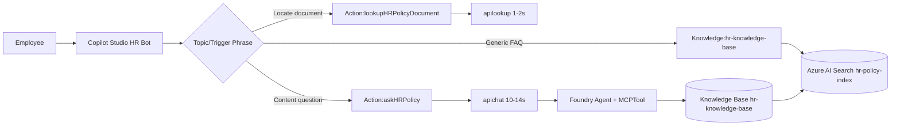

# Copilot Studio — Hybrid Orchestration Example

A worked example combining all three patterns in a single copilot:

- **Pattern A** (Knowledge Source) for fallback / autocomplete-style answers.
- **Pattern B** (Foundry Agent + MCP) for grounded answer synthesis.
- **Pattern C** (Dual-Tool Routing) for "where is the document" intents.

---

## Architecture



---

## Two Levers Recap

- **Lever 1 — Topic / Action description.** Drives which tool the LLM
  picks. Keep descriptions short, action-oriented, and disjoint.
- **Lever 2 — OpenAPI summary / Knowledge description.** Drives
  selection inside a tool group when multiple endpoints are imported
  from the same connector.

---

## Conversation Walkthrough

### Turn 1 — Document lookup

> **User:** Where's our uniform dress code policy?
>
> **Copilot Studio routing:** matches *Locate document* intent.
> Calls `lookupHRPolicyDocument({"message": "uniform dress code"})`.
>
> **Backend (`/api/lookup`):** ~1.4 s. Returns:
> ```json
> {
>   "documents": [{
>     "policy_number": "60010",
>     "parent_title": "Operational Matters: Uniform Dress Code",
>     "blob_url": "https://stxxx.blob.core.windows.net/ask-hr-knowledge/60010-uniform-dress-code.docx",
>     "metadata_storage_name": "60010-uniform-dress-code.docx",
>     "score": 4.7
>   }]
> }
> ```
>
> **Copilot Studio renders adaptive card:**
> > **Policy 60010 — Operational Matters: Uniform Dress Code**
> > [Open document]

### Turn 2 — Content question (same conversation)

> **User:** What footwear is allowed?
>
> **Copilot Studio routing:** matches *Content question* intent (and
> retains `Policy 60010` from Turn 1's slot).
> Calls `askHRPolicy({"message": "What footwear is allowed under the
> Uniform Dress Code (Policy 60010)?"})`.
>
> **Backend (`/api/chat`):** ~12 s. Foundry Agent invokes the MCP
> `knowledge_base_retrieve` tool, retrieves §3 of Policy 60010, and
> returns:
> ```json
> {
>   "answer": "Closed-toe, slip-resistant shoes are required for all uniformed staff. Open-toed sandals, flip-flops, and athletic sneakers are not permitted in customer-facing areas. [Policy 60010 - Operational Matters: Uniform Dress Code]",
>   "policy_references": ["Policy 60010 - Operational Matters: Uniform Dress Code"],
>   "confidence": 0.85
> }
> ```

### Turn 3 — Compound intent

> **User:** What's the PTO accrual rate, and can you send me the
> document?
>
> **Copilot Studio routing:** the system message says *"call askHRPolicy
> first; then call lookupHRPolicyDocument only if no inline citation is
> returned."* Inline `[Policy 50010 - …]` citation is present, so the
> copilot follows up with `lookupHRPolicyDocument` and renders a
> document card alongside the textual answer.

---

## Action Description Recipe (Lever 1)

Use this template — fill in the brackets and paste it into Copilot
Studio's Action description field.

```
Use this when the user [VERB INTENT]. Examples: "[utterance 1]",
"[utterance 2]", "[utterance 3]". Do NOT use this when [opposite intent].
Returns [output shape].
```

Filled in:

```
Use this when the user asks WHERE to find a policy. Examples: "where is
the PTO policy", "send me the dress code document", "link to holiday pay
PDF". Do NOT use this when the user asks how something works. Returns
document metadata (policy number, title, blob URL).
```

---

## Validation Checklist

- [ ] Both connectors imported and tested in **Test custom connector**.
- [ ] Action descriptions copied from
  [CopilotStudioLookupRouting.md](CopilotStudioLookupRouting.md).
- [ ] System instructions updated with routing rules.
- [ ] Adaptive card rendered for `lookupHRPolicyDocument`.
- [ ] 10-prompt smoke test (5 lookup, 5 content) routes correctly.
- [ ] Glossary at [copilot/quick_reference_guide.md](../copilot/quick_reference_guide.md)
  attached as a knowledge file or copied into the system prompt.
