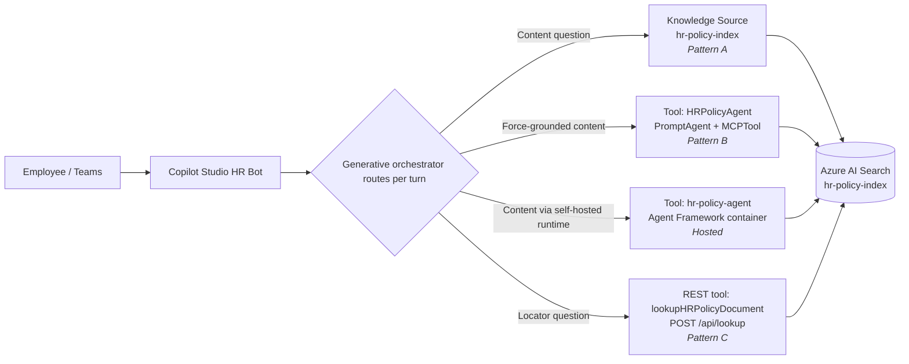
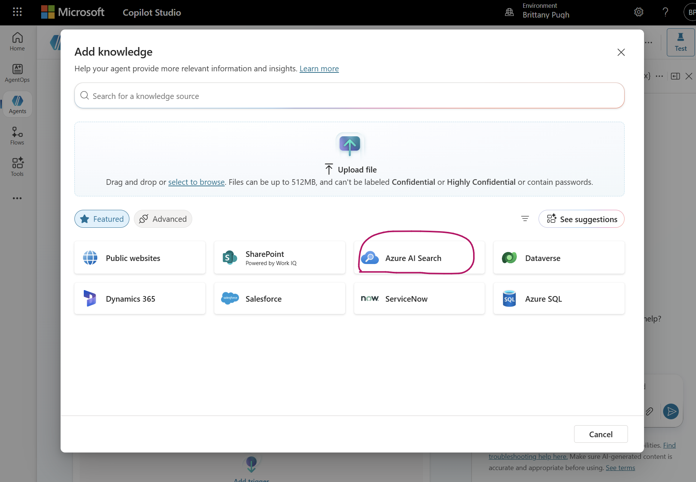
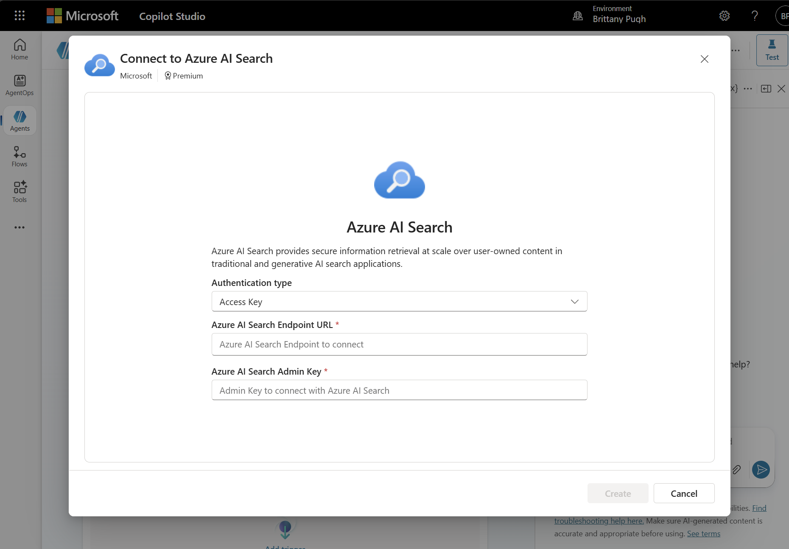
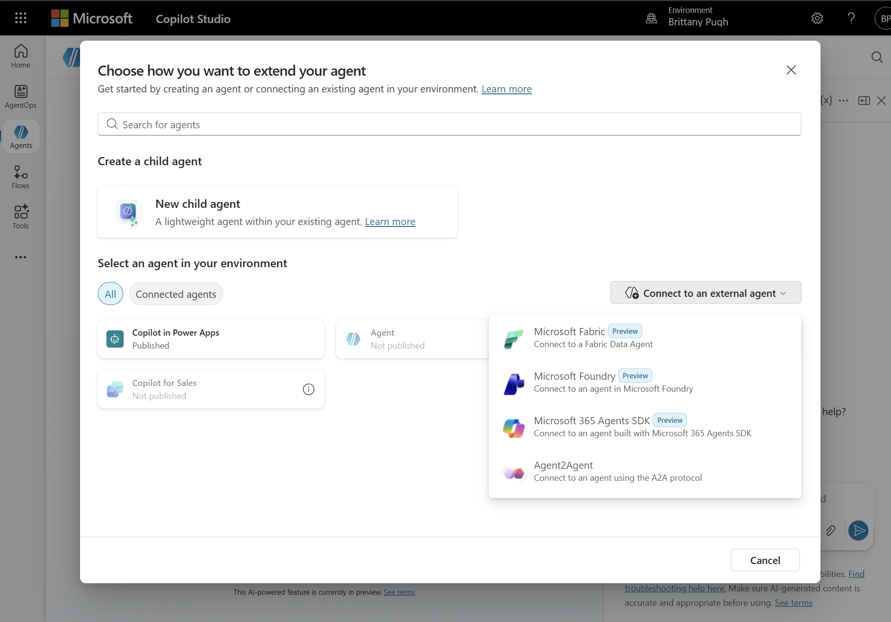

# Copilot Studio Testing Guide — Ask HR Policy Knowledge Agent

End-to-end walkthrough for wiring **all four patterns** (A, B, C, Hosted)
plus the **Hybrid** orchestration in a single Copilot Studio agent and
verifying each one with concrete test prompts.

This guide is the testing-focused companion to the per-pattern setup
docs:

- [CopilotStudioIntegration.md](CopilotStudioIntegration.md) — Pattern A / B / Hosted wiring reference
- [CopilotStudioLookupRouting.md](CopilotStudioLookupRouting.md) — Pattern C router
- [CopilotStudioHybridExample.md](CopilotStudioHybridExample.md) — Hybrid worked example

> **Screenshots.** Image placeholders below resolve once the captures
> are added to [`images/copilot-studio/`](images/copilot-studio/README.md).
> Alt text describes each screenshot, so the guide reads cleanly
> without them.

---

## ⚠️ CRITICAL: Same-Tenant Requirement

Copilot Studio and Microsoft Foundry (Azure AI Foundry) **must be in the
same Microsoft Entra ID tenant** for Patterns B and Hosted to work.
Cross-tenant calls between Copilot Studio's Foundry-agent connector and
your Foundry project are not supported.

Before you start, verify:

- Your Copilot Studio environment is in the same tenant as your Azure subscription.
- Your Azure AI Foundry project is in that same tenant.
- You are signed into both services with the same organisational account.

Pattern A and Pattern C work cross-tenant (they call Azure AI Search /
your function endpoint via API key, not Entra), but you'll want
everything in one tenant for the Hybrid test.

---

## 📋 Prerequisites

Before opening Copilot Studio, complete the bring-up in
[../README.md](../README.md). The one-shot path is **`azd up`** (after
`azd ext install azure.ai.agents`), which provisions the AI Foundry project,
Azure AI Search, Storage, **Azure Container Registry**, a **Container Apps
environment + FastAPI backend**, **Log Analytics + Application Insights**, and
all RBAC — then builds/pushes and deploys the backend + Hosted Agent images.

| ✅ | What | Why |
| -- | ---- | --- |
| ☐ | `azd up` completed (infra + services) — see [README.md § 10](../README.md#10-deploy-infrastructure-and-services) | Provisions ACR, Container Apps, App Insights + deploys backend & Hosted Agent |
| ☐ | `hr-policy-index` populated (`uv run python scripts/index_knowledge_base_integrated_vectorization.py`) | All four patterns query this index |
| ☐ | Foundry project endpoint set (`AZURE_AI_PROJECT_ENDPOINT` in `.env`) | Required for Pattern B + Hosted |
| ☐ | `HRPolicyAgent` PromptAgent provisioned (`uv run python -m src.agents.create_foundry_agent`) | Required for Pattern B |
| ☐ | `hr-policy-agent` Hosted Agent deployed (`azd deploy`, host `azure.ai.agent`; descriptor `src/hosted_agent/agent.yaml`) | Required for Hosted Agent |
| ☐ | FastAPI backend deployed on **Azure Container Apps** (via `azd up`); note its ingress URL (`azd env get-value SERVICE_BACKEND_URI`) | Required for Pattern C / B2 REST tool import |
| ☐ | Backend endpoint auth decided — Container Apps public ingress needs **no key** for a demo; for production front it with **Entra (Container Apps authentication)**. The `az functionapp keys list` / `code` query-key steps in Step C2 / D apply **only if you host the backend on Azure Functions instead**. | Pattern C / B2 auth |
| ☐ | Smoke-tested locally with `python -m scripts.demo.demo_decision_tree --skip-b --skip-hosted` | Confirms search + lookup work before Copilot Studio is in the loop |

Required RBAC on the Azure AI Search service (Patterns B / Hosted only) — all
assigned automatically by the Bicep when `AZURE_PRINCIPAL_ID` is set:

| Role | Assigned to | Purpose |
| ---- | ----------- | ------- |
| Search Index Data Contributor | Your user | Create indexes, upload docs |
| Search Index Data Reader | Your user + project managed identity + backend Container App identity | Query the index from Foundry / the backend |
| Search Service Contributor | Your user | Create knowledge bases/sources |
| Foundry Project Manager | Your user | Deploy the Hosted Agent |
| AcrPull | Project managed identity + backend Container App identity | Pull container images from ACR |

---

## 🏗️ Architecture — what Copilot Studio sees



| Path | When the planner picks it | Latency | Citation style |
| ---- | ------------------------- | ------- | -------------- |
| **Pattern A** (Knowledge Source — Azure AI Search) | Default for content questions, no extra tools | ~1–2 s | Citation card with click-through link to blob |
| **Pattern A-SP** (Knowledge Source — SharePoint) | Same as Pattern A but docs live in SharePoint | ~1–2 s | Citation card with deep link to the SharePoint file |
| **Pattern B** (Foundry Agent tool) | Content questions when force-grounded synthesis is required | ~10–14 s | Inline `[Policy XXXXX – Title]` |
| **Hosted Agent** (Foundry Agent tool, your container) | Same as Pattern B but agent runs in your infra | ~10–14 s | Inline `[Policy XXXXX – Title]` |
| **Pattern C** (REST tool) | Locator questions ("Where is X?", "Give me the link") | ~1–2 s | Verbatim URL in answer body |
| **Hybrid** | Compound questions ("Tell me about X and where I can find it") | ~10–14 s | Cited content + appended link |

> **You don't have to wire all four.** Pick the patterns you want to
> demo. The most common minimal config is **Pattern A only** (or
> **Pattern A-SP** if your docs already live in SharePoint) for fast
> start, or **Pattern A + Pattern C** for fast lookups on top of a
> citation-friendly KB.

---

## 🚀 Step-by-Step Setup

### Step A — Create the Copilot Studio agent

These steps are shared by every pattern. Do them once.

1. Go to [https://copilotstudio.microsoft.com](https://copilotstudio.microsoft.com)
   and verify the environment selector (top-right) points at the
   environment in your same tenant as Foundry.
2. Click **Create → New agent**. Enter:
   - **Name:** `Ask HR Policy Agent`
   - **Description:** `Answers employee questions using internal HR policy documents`
   - **Language:** English
3. Click **Create**.

4. On the **Overview** page, paste these instructions into the
   **Instructions** textbox and click **Save**:

   ```
   You are an HR policy assistant. Answer questions ONLY using the provided HR
   policy documents.

   - Always cite the specific policy number (e.g., Policy 51350).
   - If a policy doesn't cover the question, say so clearly.
   - Never provide legal advice.
   - Use professional, clear language.
   - Reference the exact policy title and section when possible.
   - Use FAQ documents only if the question is not relevant to a specific HR
     policy.
   ```

5. Open **Settings → Generative AI** and confirm:
   - **Use generative AI orchestration** = **Yes**
   - **Allow the AI to use its own general knowledge** = **Off**
   - **Content moderation** = **High**

> **Why these instructions?** They are loaded as the planner's
> system message. Pattern B's PromptAgent and the Hosted Agent's
> container have their own server-side system prompts
> ([hr_policy_agent.py L62-80](../src/agents/hr_policy_agent.py#L62) /
> [hr_policy_agent_af.py L52-79](../src/agents/hr_policy_agent_af.py#L52))
> that mirror these rules with stricter tool-use constraints, so you
> get consistent behaviour regardless of which path runs.

---

### Step B — Wire Pattern A (Direct Knowledge Base) ★

The simplest path — Copilot Studio's native Azure AI Search connector.

1. From the agent editor go to **Knowledge → Add knowledge → Featured → Azure AI Search**.

   

2. Click **Create new connection**. Authentication =
   **Microsoft Entra ID Integrated** (recommended — no secrets; grant the
   agent the **Search Index Data Reader** role on the search service). See
   [CopilotStudioIntegration.md § Step 2](CopilotStudioIntegration.md) for the
   full data-connection guidance.
   Fill in:

   | Field | Value |
   | ----- | ----- |
   | Azure AI Search Endpoint URL | `https://<your-search-service>.search.windows.net` |

   

3. Click **Create** (green check confirms), then **Next**.
4. Index name: `hr-policy-index`.
5. Click **Add to agent**. Wait for status **In progress → Ready**.

Pattern A is now live — skip ahead to [Test scenarios A](#scenario-a-pattern-a-direct-knowledge-base--).

---

### Step B-SP — Wire Pattern A-SP (SharePoint Knowledge Source)

Use this **instead of** Step B when your HR policy documents live in a
SharePoint document library and you want native deep-link citations
+ ACL-aware answers. You can also add A-SP **alongside** Step B — they
co-exist on the same agent and the planner will pick whichever
Knowledge Source returns better hits.

Full background: [CopilotStudioIntegration.md — Pattern A-SP wiring](CopilotStudioIntegration.md#pattern-a-sp-wiring).

1. From the agent editor go to **Knowledge → Add knowledge → Featured → SharePoint**.
2. Sign in to the SharePoint connector with an account that can read
   the policy library.
3. Paste the document library or folder URL, e.g.

   ```text
   https://<tenant>.sharepoint.com/sites/HRPolicies/Shared Documents/Policies
   ```

4. Click **Add to agent**. Wait for status **In progress → Ready**.
5. Verify the agent’s Step A Instructions are still in place — they
   apply to A-SP unchanged.

> **Pre-flight check.** Before testing, type a known policy title
> (e.g. *"Paid Time Off"*) into the SharePoint search bar at the top
> of the site. If it doesn’t appear there, Microsoft 365 search
> hasn’t indexed the file yet — wait ~15 min and retry. Copilot
> Studio can only return what M365 search can find.

Pattern A-SP is now live — use [Scenario A-SP](#scenario-a-sp-pattern-a-sp-sharepoint-knowledge-source) to verify.

---

### Step C — Wire Pattern B (Foundry Agent + MCPTool)

Two options. Pick one.

#### Option B1 — Add the Foundry agent directly (recommended)

> **⚠️ New Foundry portal only.** Copilot Studio can only connect to Foundry
> agents created in the **new Foundry portal** — connecting to one created in
> the previous portal fails with `404 - Version not found`. This repo's
> `create_foundry_agent.py` uses the GA `azure-ai-projects` SDK (new Foundry),
> so `HRPolicyAgent` is compatible.

1. **Agents → Add an agent → Connect to an external agent → Microsoft Foundry (Preview)**.
2. Select an existing **connection**, or create one using your **Foundry project
   endpoint URL**, then select **Next**.
3. Enter a **Name** and **Description** (the description drives orchestration),
   then enter the **Agent Id** — `HRPolicyAgent`. You can change the Agent Id
   later from the agent's details page.

   

4. Set **Completion → Write the response with generative AI**
   (lets Copilot Studio reformat citations).
5. Select **Add Agent**, then **Save**.

#### Option B2 — Add as a REST API tool

Use this when your Foundry agent is fronted by an HTTP endpoint. In this repo
the backend runs on **Azure Container Apps** (`/api/chat`).

1. **Tools → Add a tool → New tool → REST API**.
2. Upload [`copilot/openapi-v2.json`](../copilot/openapi-v2.json).
3. **Authentication.** Copilot Studio's REST API tool supports **None**,
   **API key**, or **OAuth 2.0** — the backend does **not** have to be Azure
   Functions. Pick based on how the endpoint is protected:

   | Backend host | Auth to select |
   | ------------ | -------------- |
   | **Container Apps — public ingress** (default here) | **None** (demo only) |
   | **Container Apps — Entra auth** (`backendAuthClientId` set) | **OAuth 2.0** (Microsoft Entra ID) |
   | **Azure Functions** | **API key** — `code` in **Query** (or `x-functions-key` in **Header**; the default `Authorization` header returns **401**) |

   > **Prefer OAuth 2.0 (Entra) beyond a quick demo.** Every other hop uses
   > Entra ID / managed identity; a function key or public ingress is a
   > shared-secret / unauthenticated shortcut. **Managed identity does not apply
   > to this hop** — Copilot Studio is a SaaS caller with no MI for outbound
   > calls, so the Entra-aligned option is OAuth 2.0. Enable Entra on the backend
   > by setting `backendAuthClientId` (an admin-created app registration); the
   > Container App then returns 401 to unauthenticated callers.

4. Map the user's message to the `message` input.
5. Under **Details → Allow agent to decide dynamically when to use the tool** = **On**.
6. **Completion → Write the response with generative AI**.

Either option leaves `askHRPolicy` (or the agent name) discoverable to
the planner. Skip ahead to [Test scenarios B](#scenario-b-pattern-b-foundry-agent--mcptool).

---

### Step D — Wire Pattern C (Dual-Tool Routing)

Pattern C layers on top of Pattern A (or B). It adds a deterministic
locator tool and a router that picks between content and locator
intents.

1. **Tools → Add a tool → New tool → REST API**.
2. Upload [`copilot/openapi-lookup-v2.json`](../copilot/openapi-lookup-v2.json).
   This Swagger 2.0 file's `description` text mirrors the canonical
   `file_metadata_lookup` tool definition from
   [honestypugh2/foundry-copilot-search-validate](https://github.com/honestypugh2/foundry-copilot-search-validate)
   — keep it verbatim so the planner picks it for "WHERE is X" intents.
3. **Authentication.** Same choices as Step C2 — **None** (Container Apps public
   ingress, demo), **OAuth 2.0** (Container Apps Entra auth via
   `backendAuthClientId`), or **API key** (`code` in **Query**, or
   `x-functions-key` in **Header**) only if the backend is on Azure Functions.
   Prefer OAuth 2.0 for production; the function-key path applies only to
   Functions hosting. Managed identity does not apply to the Copilot Studio → API
   hop.
4. Save. Confirm the operation `lookupHRPolicyDocument` appears in the
   tools list.
5. Open the agent's **Instructions** (Overview page) and **replace**
   the Step A instructions with the dual-tool router:

   ```
   You are an HR policy assistant. Decide how to answer each question:

   1. LOCATION questions — when the user asks WHERE a document is, or asks for a
      file path, storage path, blob URL, link, download link, or filename
      (e.g. "Where is the PTO policy stored?", "What's the file path for the
      Holiday Pay policy?", "Give me the link to the Code of Ethics document"):
      → Call the lookupHRPolicyDocument tool. Return the blob_url / file path and
        the filename exactly as the tool provides them. Do not summarize content.

   2. CONTENT questions — when the user asks what a policy SAYS, how it works,
      eligibility, amounts, deadlines, or process (e.g. "How much PTO do I accrue?",
      "Who is eligible for holiday pay?"):
      → Answer from the HR policy knowledge source with citations. Do NOT call the
        lookupHRPolicyDocument tool.

   3. If a question asks for BOTH the content and where to find it, answer the
      content from the knowledge source first, then call lookupHRPolicyDocument to
      append the document link.

   Never invent file paths, URLs, or policy numbers. If the lookup tool returns
   found = false, say you couldn't locate that document and ask the user to
   clarify the policy name or number.
   ```

6. Click **Save**.

Skip to [Test scenarios C](#scenario-c-pattern-c-dual-tool-routing).

> **Pattern C vs native citations.** Before wiring this, read
> [CopilotStudioLookupRouting.md § Pattern C vs native citations](CopilotStudioLookupRouting.md#pattern-c-vs-native-citations).
> If Pattern A's citation card already gives users a click-through
> link to the document, you may not need Pattern C at all.

---

### Step E — Wire the Hosted Agent

Identical to Step C Option B1, but pick the self-hosted container
instead of the Foundry-managed PromptAgent.

1. Verify the container is deployed and showing in the Foundry portal
   under **Agents** with status **Running**.

2. In Copilot Studio: **Agents → Add an agent → Connect to an external agent → Microsoft Foundry (Preview)**.
3. Select your project, then pick **`hr-policy-agent`** (not
   `HRPolicyAgent` — that's Pattern B). Both are valid; choose one.
4. **Completion → Write the response with generative AI**.
5. **Save.**

Skip to [Test scenarios H](#scenario-h-hosted-agent).

> Full deployment details for the container live in
> [README.md § 8 — Run the Hosted Agent runtime](../README.md#8-optional-run-the-hosted-agent-runtime)
> and [src/hosted_agent/agent.yaml](../src/hosted_agent/agent.yaml).

---

### Step F — Wire Hybrid (combine the lot)

The Hybrid configuration is just **Pattern A** (Knowledge Source) +
**Pattern C** (lookup REST tool) + optionally **Pattern B or Hosted**
(content agent) — all on the same Copilot Studio agent, with the
Pattern C router instructions from Step D. The planner picks the right
combination per turn.

Follow the full conversational walkthrough in
[CopilotStudioHybridExample.md](CopilotStudioHybridExample.md), then
run [Hybrid test scenarios](#scenario-hy-hybrid).

---

## 🧪 Test Scenarios

Open the **Test** pane (right side of the editor) and ask each
question. The **Activity** tab below the chat shows which knowledge
source or tool was invoked — this is how you verify routing.

---

### Scenario A — Pattern A (Direct Knowledge Base) ★

Pattern A is the default — no router instructions needed. Expect
**citation cards** with click-through links, not inline `[Policy XXXX]`.

#### A1. Basic content question

```
User: How much PTO do part-time employees accrue?
```

**Expected** (~1–2 s):

- Answer paragraph paraphrased from Policy 51355.
- A citation card linking to `51355-paid-time-off-part-time.docx` in
  blob storage.
- **Activity trace:** invocation of the `hr-policy-index` knowledge source.

#### A2. Vernacular handling

```
User: How much vacation do I get?
```

**Expected:**

- Agent maps "vacation" → "Paid Time Off" via the index synonym map
  (`hr-glossary-synonyms`) and answers from Policy 51350.
- Citation card still resolves to the PTO policy file.

#### A3. Off-topic refusal

```
User: What's the best Italian restaurant near our HQ?
```

**Expected:**

- Refusal: "I don't have information about that — please contact your
  HR representative."
- **Activity trace:** the knowledge source returned no relevant hits,
  generative AI fallback declined to answer because *Allow general
  knowledge* is **Off**.

---

<a id="scenario-a-sp-pattern-a-sp-sharepoint-knowledge-source"></a>
### Scenario A-SP — Pattern A-SP (SharePoint Knowledge Source)

Use this scenario when you wired Step B-SP. Behaviour mirrors Scenario
A, but citations resolve to **SharePoint deep links** instead of blob
URLs, and the planner enforces SharePoint ACLs per user.

#### A-SP1. Basic content question (deep-link citation)

```
User: How much PTO do part-time employees accrue?
```

**Expected** (~1–2 s):

- Answer paragraph paraphrased from Policy 51355.
- Citation card resolves to the SharePoint file, e.g.
  `https://<tenant>.sharepoint.com/sites/HRPolicies/Shared Documents/Policies/51355-paid-time-off-part-time.docx`.
  Clicking opens the doc in SharePoint with the user’s normal
  permissions.
- **Activity trace:** invocation of the SharePoint Knowledge Source
  (not `hr-policy-index`).

#### A-SP2. ACL enforcement

Sign into the Test pane (or the published bot) as **a user without
access** to the policy library.

```
User: How much PTO do part-time employees accrue?
```

**Expected:**

- Refusal or empty result — the SharePoint connector filters out
  documents the caller can’t open. This is the headline difference
  vs. Pattern A, which returns the same answer to every user.

#### A-SP3. Freshly-uploaded file

Upload a new policy `.docx` to the SharePoint library and immediately
ask:

```
User: Tell me about the new <policy-title> policy.
```

**Expected:**

- For ~5–15 min after upload, the file may **not** be returned — M365
  search hasn’t crawled it yet. Confirm by searching for the title in
  the SharePoint top-bar search; once it appears there, retry the
  Copilot Studio prompt and the answer should ground correctly.

#### A-SP4. Vernacular handling (known limitation)

```
User: How much vacation do I get?
```

**Expected:**

- M365 search may **not** map "vacation" → "Paid Time Off" the way
  Pattern A’s `hr-glossary-synonyms` does. If it misses, either:
  1. Wire Pattern A in parallel so the synonym-map fallback applies, or
  2. Add a Custom topic with explicit trigger phrases for common
     vernacular terms.

---

### Scenario B — Pattern B (Foundry Agent + MCPTool)

After Step C, content questions can also route through the
`HRPolicyAgent` tool. Expect **inline citations**
`[Policy XXXXX – Title]` instead of citation cards, and ~10–14 s
latency.

#### B1. Force-grounded content question

```
User: How much PTO do part-time employees accrue?
```

**Expected** (~10–14 s):

- Inline citation in answer body, e.g.
  `Part-time employees accrue PTO at a prorated rate based on hours
  worked. [Policy 51355 – Types of Leave: Paid Time Off (PTO) – Part-time]`
- **Activity trace:** `HRPolicyAgent` tool invocation (or `askHRPolicy`
  if you used Option B2).

#### B2. Multi-policy question

```
User: How do PTO accrual and the probationary period interact?
```

**Expected:**

- Citations to both Policy 51350 (PTO) and Policy 50455 (Probationary Period).
- Foundry's MCP tool decomposes the query into sub-queries
  (`tool_choice="required"` forces at least one retrieval).

#### B3. Verify force-grounding

```
User: What's our parental leave policy?
```

(Assuming no parental leave policy in the index.)

**Expected:**

- "I could not find this information in the HR policy documents.
  Please contact your HR representative for assistance." — verbatim
  from `AGENT_INSTRUCTIONS` rule 2 in
  [hr_policy_agent.py L67](../src/agents/hr_policy_agent.py#L67).
- Activity trace shows the MCP retrieval ran but returned no hits.

---

### Scenario C — Pattern C (Dual-Tool Routing)

After Step D, the agent's instructions force the planner to pick
`lookupHRPolicyDocument` for locator questions. Expect the
**URL printed verbatim in the answer body**, not in a citation card,
and ~1–2 s latency.

#### C1. Pure locator

```
User: Where is the PTO policy stored?
```

**Expected** (~1–2 s):

- Answer text includes the verbatim blob URL, e.g.
  `The file is at https://stxxx.blob.core.windows.net/ask-hr-knowledge/51350-paid-time-off.docx`
- **Activity trace:** `lookupHRPolicyDocument` invocation (not the knowledge source).

#### C2. File-path phrasing

```
User: What's the file path for the Holiday Pay policy?
```

**Expected:**

- Returns `metadata_storage_path` verbatim for Policy 50715.
- No summary of holiday pay content.

#### C3. Download phrasing

```
User: Give me the link to the Code of Ethics document
```

**Expected:**

- `blob_url` for Policy 31000 returned verbatim.

#### C4. Negative test — content question must NOT call the lookup tool

```
User: How many holidays do we get?
```

**Expected:**

- Routes to Pattern A (knowledge source) **or** Pattern B (agent), **not** `lookupHRPolicyDocument`.
- If the locator tool fires here, **tighten instruction rule #2** in
  Step D and re-test.

---

### Scenario H — Hosted Agent

After Step E, the planner can pick the `hr-policy-agent` container
(your self-hosted runtime). Output shape and timing are identical to
Pattern B — the difference is operational, not user-facing.

#### H1. Verify the container is the responder

```
User: What is the dress code policy?
```

**Expected** (~10–14 s):

- Cited answer from Policy 52005 (Uniform) or 52010 (Non-Uniform).
- **Activity trace:** `hr-policy-agent` tool invocation.
- Container logs (Foundry portal → Agents → `hr-policy-agent` → Logs)
  show the `search_hr_policies` `@tool` call and the search query
  that was issued.

#### H2. Force-grounding check (no `tool_choice="required"`)

```
User: What's our cryptocurrency reimbursement policy?
```

**Expected:**

- Agent runs `search_hr_policies` first (per
  `HR_POLICY_SYSTEM_PROMPT` rule 1), gets no results, then responds
  with the standard "I could not find this information…" refusal.
- This is the Hosted Agent's equivalent of `tool_choice="required"`
  — enforced via the system prompt, not the SDK, because Agent
  Framework hosting doesn't expose Foundry's tool-choice setting.

---

### Scenario Hy — Hybrid

After Step F, compound prompts trigger both the content path and the
lookup tool in a single turn.

#### Hy1. Content + locator in one prompt

```
User: Tell me about the Code of Ethics and where I can find the source document.
```

**Expected** (~12–15 s):

- Cited summary of Policy 31000 (from Pattern A knowledge source **or**
  Pattern B / Hosted agent, whichever you wired).
- Appended sentence with the verbatim blob URL from
  `lookupHRPolicyDocument`.
- **Activity trace:** two tool/knowledge invocations in the same turn.

#### Hy2. Follow-up locator in the same conversation

Turn 1:

```
User: How much PTO do I accrue per year?
```

Turn 2:

```
User: Where is that document?
```

**Expected:**

- Turn 1: content answer with `[Policy 51350 – …]` citation.
- Turn 2: planner uses Turn 1 context to call `lookupHRPolicyDocument`
  with the resolved policy number / title, returning the blob URL.

---

## 📊 Routing Summary

| User says… | Planner picks | Pattern | Latency |
| ---------- | ------------- | ------- | ------- |
| "How much PTO do I accrue?" | Knowledge Source `hr-policy-index` | **A** | ~1–2 s |
| (Same prompt, with A-SP wired) | Knowledge Source SharePoint library | **A-SP** | ~1–2 s |
| "Tell me about the Code of Ethics" | Knowledge Source | **A** or **A-SP** | ~1–2 s |
| (Same prompt, with Pattern B wired) | `HRPolicyAgent` tool | **B** | ~10–14 s |
| (Same prompt, with Hosted wired) | `hr-policy-agent` tool | **Hosted** | ~10–14 s |
| "Where is the PTO policy stored?" | `lookupHRPolicyDocument` | **C** | ~1–2 s |
| "What's the file path for Holiday Pay?" | `lookupHRPolicyDocument` | **C** | ~1–2 s |
| "Tell me about X and where I can find it" | Knowledge/Agent **then** `lookupHRPolicyDocument` | **Hybrid** | ~12–15 s |
| "What's the best restaurant nearby?" | (Refusal — general knowledge is **Off**) | — | <1 s |

---

## ✅ Setup checklist

Tick these off in order. Skip rows for patterns you're not wiring.

| ✅ | Step | Reference |
| -- | ---- | --------- |
| ☐ | Same-tenant requirement verified | This doc top |
| ☐ | `hr-policy-index` populated and reachable (Pattern A / B / C / Hosted) | [README.md § 3](../README.md) |
| ☐ | Smoke-tested locally with `scripts/demo/demo_decision_tree.py` | [scripts/demo/README.md](../scripts/demo/README.md) |
| ☐ | Copilot Studio agent created with Step A instructions | Step A |
| ☐ | Generative AI orchestration = Yes, general knowledge = Off | Step A |
| ☐ | **Pattern A** — Azure AI Search KB connected, status **Ready** | Step B |
| ☐ | **Pattern A** — A1 / A2 / A3 tests pass | Scenario A |
| ☐ | **Pattern A-SP** *(optional)* — SharePoint library connected, status **Ready** | Step B-SP |
| ☐ | **Pattern A-SP** *(optional)* — A-SP1 / A-SP2 tests pass (deep-link citation + ACL filter) | Scenario A-SP |
| ☐ | **Pattern B** — `HRPolicyAgent` provisioned (`create_foundry_agent`) | Step C |
| ☐ | **Pattern B** — Tool added (Option B1 native, or B2 REST with `code` in Query) | Step C |
| ☐ | **Pattern B** — B1 / B2 / B3 tests pass | Scenario B |
| ☐ | **Pattern C** — `openapi-lookup-v2.json` imported with `code` in Query | Step D |
| ☐ | **Pattern C** — Dual-tool router instructions saved | Step D |
| ☐ | **Pattern C** — C1 / C2 / C3 pass, C4 negative test routes to content path | Scenario C |
| ☐ | **Hosted** — `hr-policy-agent` container deployed and showing in portal | Step E |
| ☐ | **Hosted** — Tool added, H1 / H2 tests pass | Scenario H |
| ☐ | **Hybrid** — Hy1 / Hy2 pass, Activity tab shows two invocations | Scenario Hy |

---

## 🔧 Troubleshooting

| Symptom | Likely cause | Fix |
| ------- | ------------ | --- |
| Knowledge source stuck at **In progress** | Wrong endpoint or key, or index doesn't exist | Re-check endpoint URL (no trailing slash), API key, and that `hr-policy-index` exists in the Azure portal |
| Pattern A returns "I don't have information" for known-good questions | Index empty, or wrong index name | Run `uv run python scripts/index_knowledge_base_integrated_vectorization.py`; verify documents via `/api/knowledge-base` |
| Pattern A answers from general knowledge | "Allow general knowledge" left ON | **Settings → Generative AI** → toggle **Off** |
| **Pattern A-SP** — fresh upload not found | Microsoft 365 search hasn’t crawled the file yet | Confirm the title appears in the SharePoint top-bar search; wait ~15 min after upload and retry |
| **Pattern A-SP** — citation deep link 404s for some users | Per-user SharePoint ACL doesn’t grant access | Grant the user **Read** on the library or specific file in SharePoint; this is the connector enforcing ACLs as designed |
| **Pattern A-SP** — vernacular like "vacation" misses | No synonym map on the SP connector | Wire Pattern A alongside, or add a Custom topic for the term |
| Foundry agent tool dropdown is empty | PromptAgent not published, or different tenant | Run `uv run python -m src.agents.create_foundry_agent --verify-only`; confirm tenant alignment |
| Pattern B / Hosted returns 401 in Activity trace | RBAC not assigned to project managed identity | Assign **Search Index Data Reader** to the Foundry project's managed identity on the search service |
| REST tool returns 401 even with key | Auth set to **Header** with the default header name instead of **Query** | Use `code` in **Query**, or **Header** with parameter name `x-functions-key` (the default `Authorization` header name returns 401) |
| Connection error: *"Let's get you connected first"* | Copilot Studio connection to Foundry Agent Service expired | **Open connection manager → Azure AI Foundry Agent Service → Connect**, then **Retry** in the chat |
| Pattern C fires on content questions | Tool description too generic, or router instructions weak | Restore `description` text in `openapi-lookup-v2.json` verbatim; tighten rule #2 in Step D instructions |
| Hosted Agent answers without calling `search_hr_policies` | System prompt rule 1 ignored by the model | Lower temperature in `FoundryChatClient` config, or move the "MUST call search_hr_policies first" rule to the top of `HR_POLICY_SYSTEM_PROMPT` |
| Hybrid turn only returns content, no appended link | Router instruction rule #3 omitted, or Pattern C tool not in scope | Re-apply Step D instructions; verify `lookupHRPolicyDocument` is in the Tools list |

---

## 🔁 Re-test loop

When you change any of:

- Index contents (re-ran an indexer)
- Agent instructions (Step A or Step D)
- Tool descriptions (re-imported OpenAPI)
- PromptAgent definition (re-ran `create_foundry_agent`)
- Hosted container (re-deployed)

…rerun the relevant **Scenario** section. The local
`scripts/demo/demo_decision_tree.py` walk-through is faster than the
Copilot Studio test pane for verifying the backend; reserve the
Copilot Studio Test pane for verifying the **router** (which tool the
planner picked) via the Activity tab.

---

## 📚 Related docs

- [README.md](../README.md) — repo overview and decision tree
- [CopilotStudioIntegration.md](CopilotStudioIntegration.md) — full per-pattern wiring reference
- [CopilotStudioLookupRouting.md](CopilotStudioLookupRouting.md) — Pattern C router (Levers 1 & 2)
- [CopilotStudioHybridExample.md](CopilotStudioHybridExample.md) — Hybrid conversational walkthrough
- [RetrievalPatterns.md](RetrievalPatterns.md) — pattern comparison + decision tree
- [LabCoverage.md](LabCoverage.md) — cross-walk to Azure/Copilot-Studio-and-Azure labs
- [scripts/demo/README.md](../scripts/demo/README.md) — local CLI walk-throughs for each pattern
- [images/copilot-studio/README.md](images/copilot-studio/README.md) — screenshot capture checklist
