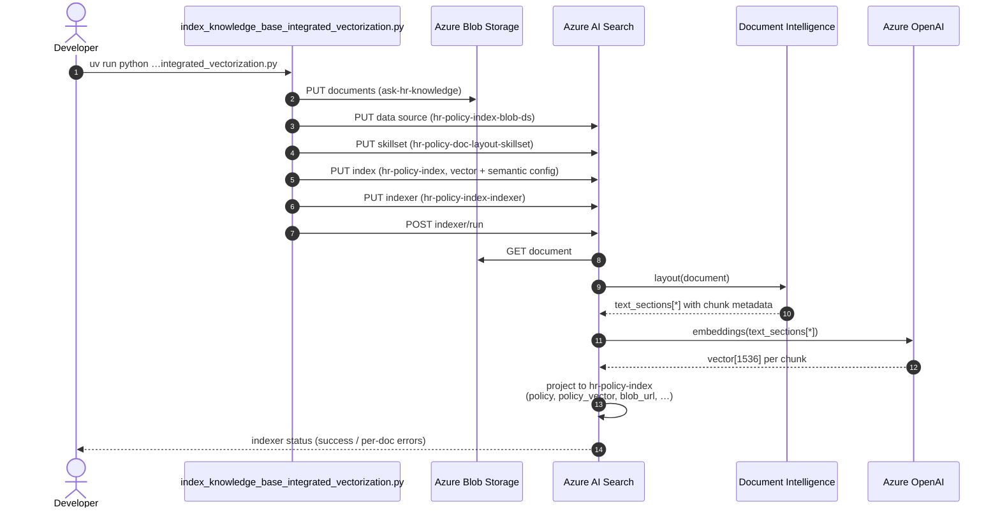

# Data Ingestion, Pre-Processing Pipeline, and Testing

This document covers the end-to-end data pipeline — from raw HR policy documents to a searchable Azure AI Search index — and the testing strategy used to validate each stage.

> **Related docs:** [RetrievalPatterns.md](RetrievalPatterns.md) covers the high-level architecture patterns. This document goes deeper into the data flow, pre-processing steps, and test coverage.

---

## Table of Contents

- [Data Sources](#data-sources)
- [Pre-Processing Pipeline](#pre-processing-pipeline)
  - [Document Extraction](#1-document-extraction)
  - [Chunking](#2-chunking)
  - [Glossary Enrichment](#3-glossary-enrichment)
  - [Embedding Generation](#4-embedding-generation)
  - [Indexing](#5-indexing)
- [Pattern 1, Option 1: DocIntel + Client-Side Chunking](#pattern-1-option-1-docIntel--client-side-chunking)
- [Pattern 1, Option 2: Integrated Vectorization](#pattern-1-option-2-integrated-vectorization)
- [Pattern 2: Foundry Agent Action](#pattern-2-foundry-agent-action)
- [Testing](#testing)
  - [Test Configuration](#test-configuration)
  - [Test Suites](#test-suites)
  - [Running Tests](#running-tests)

---

## Data Sources

HR policy documents are stored locally in the `data/` directory:

```
data/
├── knowledge_base/            # Production knowledge base
│   └── ASK HR Knowledge/      # HR policy documents (.docx, .doc, .txt)
├── knowledge_base_lab/        # Lab/dev documents for testing
│   ├── 30010 - Hours Worked and Pay Administration_ Holiday Pay (1007_0)/
│   ├── 50010 - Types of Leave_ Paid Time Off (PTO) (1010_0)/
│   ├── 60010 - Operational Matters_ Uniform Dress Code (1013_0)/
│   └── ...                    # ~29 policy directories
└── uploads/                   # Staging area
```

Each policy directory contains one or more document files. The directory name follows the format `{policy_number} - {policy_title} ({internal_id})`.

---

## Pre-Processing Pipeline

Both Pattern 1 options share a common pre-processing pipeline with five stages. The difference is **where** each stage runs — client-side (Option 1) or server-side via Azure AI Search skillsets (Option 2).

```
┌──────────────┐    ┌──────────┐    ┌───────────┐    ┌───────────┐    ┌──────────┐
│   Extract    │───▶│  Chunk   │───▶│  Enrich   │───▶│   Embed   │───▶│  Index   │
│  (Document   │    │ (Fixed   │    │ (Glossary │    │ (Vector   │    │ (Push or │
│   Intel.)    │    │  Size or │    │  Terms)   │    │  Embedding│    │  Indexer) │
│              │    │  Layout) │    │           │    │           │    │          │
└──────────────┘    └──────────┘    └───────────┘    └───────────┘    └──────────┘
```

### 1. Document Extraction

**Module:** `src/document_processing/document_ingestion.py`

The `DocumentIngestionAgent` class extracts text from HR policy documents using a priority chain:

| Priority | Method | File Types | Details |
|----------|--------|------------|---------|
| 1 | Azure Document Intelligence | `.pdf`, `.docx`, `.doc`, `.xlsx`, `.pptx` | `prebuilt-layout` model, handles tables & images |
| 2 | python-docx | `.docx` | Local parsing, no Azure dependency |
| 3 | antiword | `.doc` | Legacy binary Word format via `antiword` CLI |
| 4 | olefile (pure-Python) | `.doc` | Fallback when `antiword` is unavailable — recovers printable text runs from the OLE `WordDocument` stream (handles both cp1252 and UTF-16LE encodings); `extraction_method: olefile_worddocument` |
| 5 | Plain text | `.txt` | Direct file read |

> **Legacy `.doc` note:** Azure Document Intelligence and its server-side Layout skill reject legacy binary `.doc` files (`InvalidContent`). Option 1 recovers their text with the `antiword` → `olefile` fallback chain; Option 2 skips them at the indexer (see below).

**Usage:**
```python
from src.document_processing.document_ingestion import DocumentIngestionAgent

agent = DocumentIngestionAgent(use_azure=True)
result = agent.process_document("data/knowledge_base_lab/50010 - .../policy.docx")
# Returns: {
#     "text": "Full extracted text...",
#     "page_count": 3,
#     "word_count": 1240,
#     "char_count": 7800,
#     "tables": [...],
#     "extraction_method": "azure_document_intelligence"
# }
```

**Helper functions:**

| Function | Purpose |
|----------|---------|
| `generate_document_id(file_path)` | Deterministic MD5-based document ID from file path |
| `extract_policy_number(filename)` | Extracts 5–6 digit policy number (e.g., `"50010"`) from filename |
| `categorize_policy(filename)` | Maps filename keywords to categories: `hiring`, `leave`, `career_path`, `compensation`, `operational`, `ethics`, `safety`, `general` |

### 2. Chunking

**Module:** `src/document_processing/chunking.py`

Large documents are split into overlapping chunks for optimal retrieval. Each chunk is independently searchable and embeddable.

```python
from src.document_processing.chunking import fixed_size_chunking, TextChunk

chunks: list[TextChunk] = fixed_size_chunking(
    text="Full document text...",
    size=2000,       # Characters per chunk
    overlap=200,     # Overlap between consecutive chunks
    document_id="doc_abc123"
)
# Each TextChunk has: chunk_id, chunk_index, text
```

**Parameters:**

| Parameter | Default | Description |
|-----------|---------|-------------|
| `size` | 500 | Maximum characters per chunk |
| `overlap` | 50 | Characters shared between consecutive chunks |
| `document_id` | `"document"` | Prefix for deterministic chunk ID generation |

**Chunk ID generation:** `_stable_chunk_id()` produces a deterministic ID using `{document_id}:{chunk_index}` prefix + MD5 hash of chunk text. This ensures idempotent re-indexing — re-running the pipeline produces the same IDs.

**Validation rules:**
- `size` must be > 0
- `overlap` must be ≥ 0 and < `size`

> **Note:** Pattern 1 Option 1 uses `size=2000, overlap=200`.

### 3. Glossary Enrichment

**Module:** `src/search/search_service.py`

The HR glossary maps ~30 informal/shorthand terms to formal policy names. It is used at two stages:

#### At index time — `enrich_content_with_glossary(content, title="")`

Appends matching glossary terms to document content so keyword search can find documents using either vernacular or formal terms:

```python
from src.search.search_service import enrich_content_with_glossary

enriched = enrich_content_with_glossary(
    content="Employees receive 10 days of PTO annually.",
    title="50010 - Types of Leave_ Paid Time Off"
)
# Appends: "\n\n--- HR Glossary Terms ---\nPTO: Paid Time Off\n..."
```

#### At query time — `expand_query_with_glossary(query)`

Expands user queries with formal terminology before searching:

```python
from src.search.search_service import expand_query_with_glossary

expanded = expand_query_with_glossary("What is the PTO policy?")
# Returns: "What is the PTO (Paid Time Off) policy?"
```

#### At index level — Synonym map

Both search services create an Azure AI Search synonym map (`hr-glossary-synonyms`) from the same `HR_GLOSSARY` dictionary. This handles vernacular expansion at the search engine level for clients that bypass the Python backend (e.g., Copilot Studio).

**Sample glossary entries:**

| Vernacular | Formal Term |
|------------|-------------|
| `pto` | Paid Time Off |
| `dress code` | Uniform Dress Code |
| `holidays` | Holiday Pay |
| `probation` | Probationary Period |
| `bbp` | Blood Borne Pathogens |
| `rehire` | Rehiring of Retirees |
| `sick leave` | Short-Term Disability |

### 4. Embedding Generation

All patterns use **Azure OpenAI `text-embedding-3-small`** with **1536 dimensions**.

| Pattern | Where | How |
|---------|-------|-----|
| Option 1 | Client-side | `openai.embeddings.create(model="text-embedding-3-small", input=chunk_text)` |
| Option 2 | Server-side | `AzureOpenAIEmbeddingSkill` in the skillset pipeline |

Embeddings are stored in the `policy_vector` field (Collection(Edm.Single), 1536 dims) with an **HNSW** algorithm profile and **scalar quantization** (int8 with rescoring enabled) for memory efficiency.

### 5. Indexing

The index schema is defined in `src/config/search_config.json` and shared across all patterns.

**Key index fields:**

| Field | Type | Purpose |
|-------|------|---------|
| `id` | String (key) | Unique chunk identifier |
| `policy_vector` | Vector (1536) | Embedding for vector search |
| `policy` | String (searchable) | Chunk content text |
| `policy_with_source` | String | Content with source metadata appended |
| `parent_title` | String (filterable) | Source document title |
| `policy_number` | String (filterable) | 5–6 digit policy number |
| `policy_parent_id` | String (filterable) | Parent document ID (for parent-child grouping) |
| `metadata_storage_name` | String | Original filename |
| `metadata_storage_path` | String | Blob storage path |
| `blob_url` | String | Full blob URL |

**Search capabilities:**
- **Hybrid search:** Text (BM25) + Vector (HNSW cosine) + Semantic reranker
- **Synonym expansion:** `hr-glossary-synonyms` on `parent_title`, `policy`, `policy_with_source` fields
- **Semantic configuration:** `hr-semantic-config` with `BoostedRerankerScore`

---

## Pattern 1, Option 1: DocIntel + Client-Side Chunking

**Script:** `scripts/index_knowledge_base_docintel_chunking.py`

Runs the full pre-processing pipeline client-side: extract → chunk → enrich → embed → push.

```
HR Policy Documents (.docx/.doc/.txt)
        │
        ▼
Azure Document Intelligence (prebuilt-layout)
        │  Extracts text, tables, layout
        ▼
fixed_size_chunking(size=2000, overlap=200)
        │  Splits into overlapping chunks
        ▼
enrich_content_with_glossary()
        │  Appends matched HR terms
        ▼
Azure OpenAI Embedding (text-embedding-3-small)
        │  Generates 1536-dim vectors per chunk
        ▼
Azure AI Search Push API
        │  Uploads documents with parent-child mapping
        ▼
hr-policy-index
```

**Key functions:**

| Function | Purpose |
|----------|---------|
| `generate_doc_id(file_path, chunk_index)` | Deterministic chunk ID |
| `run(data_dir, local_only)` | Main pipeline entry point |

**Usage:**
```bash
# Full pipeline — extract, chunk, embed, push to index
python scripts/index_knowledge_base_docintel_chunking.py

# Test extraction locally without Azure Search
python scripts/index_knowledge_base_docintel_chunking.py --local-only

# Use a different data directory
python scripts/index_knowledge_base_docintel_chunking.py --data-dir data/knowledge_base_lab
```

**When to use:**
- Full control over each pipeline stage
- Local development and debugging
- CI/CD pipelines or batch re-indexing
- Need glossary enrichment at content level (not just synonym map)

---

## Pattern 1, Option 2: Integrated Vectorization

**Script:** `scripts/index_knowledge_base_integrated_vectorization.py`

Delegates extraction, chunking, and embedding to Azure AI Search's built-in skillset pipeline. The script sets up the Azure resources; the indexer runs automatically.

### Sequence



### What gets created

| Resource             | Service              | Name                                | Notes                                                |
| -------------------- | -------------------- | ----------------------------------- | ---------------------------------------------------- |
| Container            | Blob Storage         | `ask-hr-knowledge`                  | Source of truth for raw HR policy documents          |
| Data source          | Azure AI Search      | `hr-policy-index-blob-ds`           | Connection from Search to the blob container         |
| Skillset             | Azure AI Search      | `hr-policy-doc-layout-skillset`     | DocumentIntelligenceLayoutSkill + AzureOpenAIEmbeddingSkill; AI Services attached via the Search service's managed identity |
| Index                | Azure AI Search      | `hr-policy-index`                   | Vector field `policy_vector` (1536) + semantic config `hr-semantic-config` |
| Indexer              | Azure AI Search      | `hr-policy-index-indexer`           | Runs the skillset; auto-tracks blob changes          |
| Synonym map          | Azure AI Search      | `hr-glossary-synonyms`              | HR vernacular → formal terms                         |
| Vectorizer           | Azure AI Search      | `hr-azure-openai-vectorizer`        | Query-time embedding via Azure OpenAI                |

All names are configurable via `src/config/search_config.json`.

> **AI Services attachment (required past 20 documents).** The skillset attaches
> the AI Services account so the `DocumentIntelligenceLayoutSkill` can enrich
> more than the free tier's **20 documents per run**. Because enterprise
> policy commonly disables local (key) auth, the attachment uses the Search
> service's **system-assigned managed identity** (`AIServicesByIdentity`), which
> needs the **Cognitive Services User** role on the AI Services account — granted
> automatically by the Bicep (`infra/bicep/main.bicep`). Without an attached
> resource the indexer stops at 20 docs with a `transientFailure` and retries
> indefinitely.
>
> **Skillset API version.** The `DocumentIntelligenceLayoutSkill` properties
> require a preview REST API version for the skillset — set via
> `indexer.api_version` (`2025-05-01-preview`) in `search_config.json`.
>
> **Unsupported formats.** Legacy binary `.doc` is excluded at the indexer
> (`excludedFileNameExtensions`), and `.xlsx` is not supported by the Layout
> skill; these are expected, tolerated failures (`maxFailedItems=-1`).

```
HR Policy Documents
        │
        ▼
Azure Blob Storage (ask-hr-knowledge container)
        │
        ▼
Azure AI Search Indexer (hr-policy-index-indexer)
        │
        ├─── Data Source: hr-policy-index-blob-ds
        │       └── Blob container connection
        │
        ├─── Skillset: hr-policy-doc-layout-skillset
        │       ├── DocumentIntelligenceLayoutSkill
        │       │     outputMode: oneToMany
        │       │     outputFormat: text
        │       │     chunkingProperties: { max: 2000, overlap: 200 }
        │       │
        │       └── AzureOpenAIEmbeddingSkill
        │             context: /document/text_sections/*
        │             model: text-embedding-3-small (1536 dims)
        │
        └─── Index Projections
                sourceContext: /document/text_sections/*
                projectionMode: skipIndexingParentDocuments
                mappings: policy_vector, policy, blob_url, metadata fields
        │
        ▼
hr-policy-index (auto-populated)
```

**Key functions:**

| Function | Purpose |
|----------|---------|
| `upload_documents(data_dir)` | Upload files to Blob Storage, attaching `parent_title` / `policy_number` / `category` (derived from the filename, matching Option 1) as blob metadata |
| `create_synonym_map()` | Create `hr-glossary-synonyms` from `HR_GLOSSARY` |
| `create_index()` | Create the search index with vector + semantic config |
| `create_data_source()` | Create blob data source connection (keyless via managed identity when shared-key access is disabled) |
| `create_skillset()` | Create skillset with Document Layout + Embedding skills; attaches the AI Services account via managed identity (`AIServicesByIdentity`) |
| `create_indexer()` | Create indexer that ties data source → skillset → index; excludes legacy `.doc` and tolerates unsupported-file failures (`maxFailedItems=-1`) |
| `run(data_dir, upload_only, create_pipeline_only)` | Main entry point |

**Usage:**
```bash
# Full setup — upload + create index + skillset + indexer
python scripts/index_knowledge_base_integrated_vectorization.py

# Upload documents only (index pipeline already exists)
python scripts/index_knowledge_base_integrated_vectorization.py --upload-only

# Create the search pipeline only (documents already uploaded)
python scripts/index_knowledge_base_integrated_vectorization.py --create-pipeline-only
```

**When to use:**
- Production deployment with automatic re-indexing
- Documents change frequently (indexer tracks blob changes)
- Prefer structure-aware chunking (headings, paragraphs, tables)
- Minimal code maintenance — Azure manages the pipeline

**Key difference from Option 1:** Glossary enrichment is handled entirely by the synonym map at query time, not by appending terms to content. The `DocumentIntelligenceLayoutSkill` provides structure-aware chunking that respects document headings and paragraph boundaries, unlike the fixed-size character splitting in Option 1.

**Metadata parity with Option 1:** `parent_title`, `policy_number`, and `category` are derived from the filename (same helpers as Option 1) and attached as blob metadata during upload. The blob indexer surfaces them at `/document/<field>`, and the index projection maps them onto every chunk — so both options populate the same fields.

---

## Pattern 2: Foundry Agent Action

**Script:** `src/agents/create_foundry_agent.py`

Creates Microsoft Foundry resources for agentic retrieval. This pattern wraps the same `hr-policy-index` in a Foundry Knowledge Base and connects it to a Foundry Agent via an MCP tool.

> **Prerequisite:** The index must already be populated via Pattern 1 (Option 1 or Option 2).

```
src/agents/create_foundry_agent.py
        │
        ├── 1. create_knowledge_source()
        │       └── hr-knowledge-source → points to hr-policy-index
        │
        ├── 2. create_knowledge_base()
        │       └── hr-knowledge-base → wraps knowledge source(s)
        │
        ├── 3. create_mcp_connection()
        │       └── MCP connection (project managed identity)
        │
        └── 4. create_foundry_agent()
                └── HRPolicyAgent (gpt-5-mini) + knowledge_base_retrieve MCP tool
```

**Agent configuration** is driven by `src/config/search_config.json`:

| Config Key | Purpose |
|------------|---------|
| `agentic_retrieval.knowledge_source_name` | Knowledge source name (`hr-knowledge-source`) |
| `agentic_retrieval.knowledge_base_name` | Knowledge base name (`hr-knowledge-base`) |
| `agentic_retrieval.output_mode` | Retrieval output mode (`EXTRACTIVE`) |
| `agentic_retrieval.retrieval_reasoning_effort` | Reasoning effort (`medium`) |
| `foundry_agent.model` | LLM model (`gpt-5-mini`) |
| `foundry_agent.retrieval_instructions` | Detailed retrieval guidelines |
| `foundry_agent.answer_instructions` | Detailed answer generation guidelines |

**Usage:**
```bash
# Full setup
python -m src.agents.create_foundry_agent

# Verify all resources exist
python -m src.agents.create_foundry_agent --verify-only

# Cleanup Foundry IQ resources
python -m src.agents.create_foundry_agent --cleanup
```

**RBAC requirements:**

| Role | Assigned To | Purpose |
|------|-------------|---------|
| Search Index Data Contributor | Your user identity | Create indexes, upload documents |
| Search Index Data Reader | User + Project Managed Identity | Query indexes, access knowledge base |
| Search Service Contributor | Your user identity | Create knowledge bases and sources |

---

## Testing

### Test Configuration

**File:** `pytest.ini`

```ini
[pytest]
testpaths = tests
markers =
    live: marks tests that require a running Azure Function
    mock: marks tests that can run fully mocked (no Azure needed)
asyncio_mode = auto
```

**Fixture setup:** `tests/conftest.py` adds the project root to `sys.path` so tests can import from `src/`.

### Test Suites

#### Document Processing — `tests/test_document_processing.py`

Tests the extraction helpers without requiring Azure credentials.

| Test Class | Tests | What It Validates |
|------------|-------|-------------------|
| `TestExtractPolicyNumber` | 4 tests | Policy number extraction from filenames: standard format (`50010`), five-digit, six-digit (`900100`), no-number fallback |
| `TestCategorizePolicy` | 6 tests | Category assignment from filenames: `leave`, `hiring`, `ethics`, `safety`, `compensation`, `general` (fallback) |
| `TestGenerateDocumentId` | 2 tests | Deterministic IDs (same input → same ID), uniqueness (different inputs → different IDs) |

#### Chunking — `tests/test_chunking.py`

Tests the `fixed_size_chunking()` function with edge cases.

| Test | What It Validates |
|------|-------------------|
| `test_empty_text_returns_empty_list` | Empty input returns `[]` |
| `test_invalid_size_raises` | `size <= 0` raises `ValueError` |
| `test_invalid_overlap_raises` | `overlap < 0` or `overlap >= size` raises `ValueError` |
| `test_chunking_no_overlap_and_indices_and_ids` | `"abcdefghij"`, size=4, overlap=0 → `["abcd", "efgh", "ij"]` with correct indices |
| `test_chunking_with_overlap` | `"abcdefghij"`, size=4, overlap=2 → `["abcd", "cdef", "efgh", "ghij"]` |
| `test_chunk_ids_are_deterministic` | Same text/params → same chunk IDs across runs |

#### Search & Glossary — `tests/test_search.py`

Tests the glossary expansion logic and `HR_GLOSSARY` integrity.

| Test Class | Tests | What It Validates |
|------------|-------|-------------------|
| `TestGlossaryExpansion` | 6 tests | PTO expansion, dress code expansion, no-match passthrough, multiple terms in one query, case-insensitive matching |
| `TestSearchServiceInit` | 1 test | All `HR_GLOSSARY` keys are lowercase (invariant enforced) |
| _(standalone)_ | 1 test | `HR_GLOSSARY` has ≥ 10 entries |

#### Backend API — `tests/test_backend.py`

Tests the FastAPI endpoints using `httpx.AsyncClient`.

| Test | Endpoint | What It Validates |
|------|----------|-------------------|
| `test_health_endpoint` | `GET /api/health` | Returns status and services info |
| `test_glossary_endpoint` | `GET /api/glossary` | Returns glossary dict with `total` count |
| `test_azure_status_endpoint` | `GET /api/azure/status` | Returns AI Search and OpenAI status |
| `test_chat_endpoint` | `POST /api/chat` | Accepts `{message, conversation_history}`, returns `{answer, citations, confidence, ...}` |
| `test_chat_empty_question` | `POST /api/chat` | Empty message still returns 200 |
| `test_knowledge_base_endpoint` | `GET /api/knowledge-base` | Returns `{total_documents, documents}` |

### Running Tests

```bash
# Run all tests
pytest

# Run a specific test file
pytest tests/test_chunking.py

# Run tests with verbose output
pytest -v

# Run only mock tests (no Azure credentials needed)
pytest -m mock

# Run only tests that need Azure
pytest -m live
```

**Tests that run without Azure credentials:**
- All `test_chunking.py` tests
- All `test_document_processing.py` tests
- All `test_search.py` glossary tests
- Backend endpoint tests (mocked services)

**Tests that require Azure credentials:**
- Backend tests with real search service integration (marked `live`)

---

## Utility Scripts

### Upload to Blob — `scripts/upload_to_blob.py`

Uploads raw documents to Azure Blob Storage. Used as a prerequisite for Pattern 1, Option 2 (Integrated Vectorization).

```bash
# Upload to default container (ask-hr-knowledge)
python scripts/upload_to_blob.py

# Dry run — preview what would be uploaded
python scripts/upload_to_blob.py --dry-run

# Custom container
python scripts/upload_to_blob.py --container my-container

# Specific directories
python scripts/upload_to_blob.py --dirs data/knowledge_base data/knowledge_base_lab
```

Supports both connection string and managed identity authentication. Uses flat blob layout (filenames only, no subdirectories).

### Project Setup — `scripts/setup.sh`

One-time environment setup:

```bash
./scripts/setup.sh
```

1. Checks for `uv` package manager
2. Creates Python virtual environment (`.venv/`)
3. Installs Python dependencies from `pyproject.toml`
4. Installs frontend dependencies (`npm install`)
5. Creates `.env` from `.env.example` if missing
6. Prints next steps for indexing and backend startup
