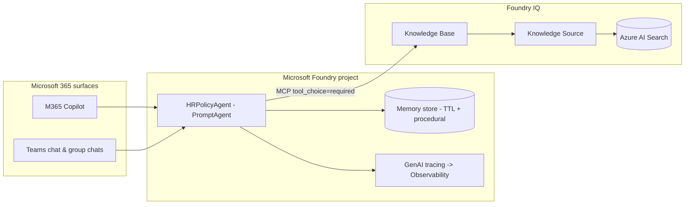

# Pattern B+ — Distributing the HR Policy Agent to Microsoft 365 Copilot & Teams

> **Status:** Publishing Foundry agents to Microsoft 365 Copilot and Teams
> reached **general availability on 10 June 2026**. Autopilot agents are in
> **public preview**. This document extends [Pattern B](RetrievalPatterns.md)
> (Foundry Agent Service prompt agent + MCP) with the enterprise distribution
> surface.

## Why this matters

Patterns A–C and the Hosted Agent all assume **Copilot Studio is the front
door**. That is still valid. But after BUILD 2026, a Foundry agent no longer
has to be re-built per surface: you author once and publish through **one
governed pipeline** into Microsoft 365 Copilot and Teams. The `HRPolicyAgent`
prompt agent this repo provisions in
[`src/agents/create_foundry_agent.py`](../src/agents/create_foundry_agent.py) is
exactly the artifact you publish.

The interaction model also shifts from chatbot-style *prompt → response* to
**goal → ongoing execution → checkpoints → collaboration**: you assign the agent
a goal, and it surfaces progress, requests approvals, and escalates to a human —
natively inside Teams and Microsoft 365.

## Two distribution options

| Option | What it is | When to use for HR |
| ------ | ---------- | ------------------ |
| **Published Foundry agent** (GA) | The Pattern B `HRPolicyAgent` published into M365 Copilot and Teams from the Foundry portal, keeping its MCP knowledge-base grounding. | Employee self-service "Ask HR" inside the tools staff already use, without a Copilot Studio front door. |
| **Autopilot agent** (public preview) | A new agent category with its own [Entra Agent ID user account](https://learn.microsoft.com/en-us/entra/agent-id/agent-users) — email, calendar, OneDrive, Teams presence — designed to work *in shared spaces* like Teams group chats. | An HR agent that lives in an HR-operations group chat, tracks open cases, follows up on overdue items, and summarizes threads into action items. |

The reference implementation for autopilot agents is the
[Foundry Workstream Manager](https://github.com/microsoft-foundry/foundry-samples/tree/main/samples/csharp/foundry-workstream-manager-autopilot-agent)
sample — a good starting point to customize rather than building the Teams/M365
integration from scratch.

## Reference architecture



## How to publish (Pattern B → Pattern B+)

1. **Provision Pattern B** if you have not already:
   ```bash
   AGENT_SERVICE=foundry python -m src.agents.create_foundry_agent
   ```
   This creates the Knowledge Source, Knowledge Base, MCP connection, and the
   `HRPolicyAgent` prompt agent.
2. **(Recommended) Provision memory** so multi-turn HR conversations stay
   coherent and personalized with bounded retention:
   ```bash
   python -m src.memory.memory_store --ttl-days 30
   ```
   See [`src/memory/memory_store.py`](../src/memory/memory_store.py). TTL keeps
   HR context from being retained indefinitely (a compliance requirement).
3. **Enable tracing** before you distribute, so production behaviour is
   observable across surfaces (set `APPLICATIONINSIGHTS_CONNECTION_STRING`); see
   [`src/observability/tracing.py`](../src/observability/tracing.py).
4. **Publish** the agent to Microsoft 365 Copilot and Teams from the Foundry
   portal's publishing pipeline. The agent keeps its MCP knowledge-base grounding
   as it moves toward org-wide availability.

## Governance checklist

- **Entra Agent ID** — assign each distributed agent its own identity so
  connector permissions, Conditional Access, and DLP scope to the agent, not a
  shared app registration.
- **RBAC** — the agent's identity needs `Search Index Data Reader` on the Azure
  AI Search service (grounding) and the appropriate Foundry project role.
- **Evaluation gate** — run the [evaluation harness](../src/evaluation/run_eval.py)
  against [`eval/datasets/hr_qa_testset.csv`](../eval/datasets/hr_qa_testset.csv)
  before promoting a new agent version to a shared surface.
- **Memory retention** — keep a non-zero TTL for anything touching personal or
  time-sensitive HR data.
- **Content recording** — leave GenAI trace content recording **off** unless the
  environment is approved to capture HR conversation content.

## Relationship to the other patterns

| Front door | Runtime | Grounding | Doc |
| ---------- | ------- | --------- | --- |
| Copilot Studio | Copilot Studio | AI Search KB | [Pattern A](RetrievalPatterns.md) |
| Copilot Studio | Foundry Agent Service | MCP KB | [Pattern B](RetrievalPatterns.md) |
| **M365 Copilot / Teams** | **Foundry Agent Service** | **MCP KB** | **Pattern B+ (this doc)** |
| Copilot Studio | Your container | `@tool` search | [Hosted Agent](CopilotStudioIntegration.md#hosted-agent-wiring) |

Pattern B+ does not replace the Copilot Studio patterns — it adds Microsoft 365
Copilot and Teams as first-class distribution surfaces for the same governed
Foundry agent.
