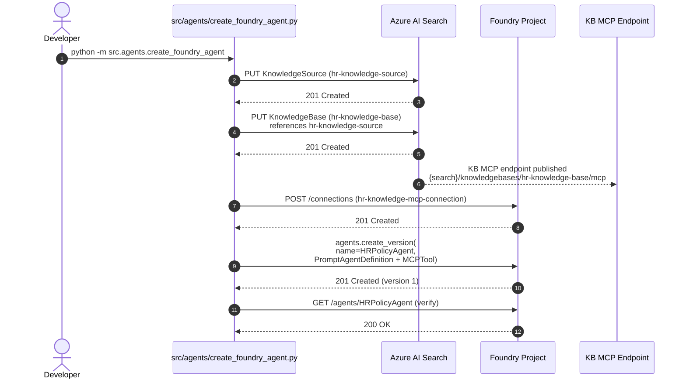

# Foundry Agent Architecture (Pattern B)

How the **Foundry Agent Service prompt agent** is wired up in this repo,
and why it answers HR questions reliably.

> Pattern B is the default ([RetrievalPatterns.md](RetrievalPatterns.md)).
> Provision it with `python -m src.agents.create_foundry_agent`.

---

## 1. End-to-end Architecture

```mermaid
flowchart LR
    subgraph CS[Copilot Studio]
        topic[Topic / Action] -->|askHRPolicy| connector[Custom Connector]
    end
    subgraph Backend[FastAPI Backend src/backend/main.py]
        chat[/api/chat/]
    end
    subgraph Foundry[Foundry Agent Service]
        agent[PromptAgent: HRPolicyAgent]
    end
    subgraph KB[Knowledge Base hr-knowledge-base]
        kbmcp[KB MCP endpoint]
        ks[Knowledge Source: hr-knowledge-source]
    end
    subgraph Search[Azure AI Search]
        index[(hr-policy-index)]
    end

    connector --> chat
    chat -->|"openai.responses.create<br/>extra_body=agent_reference"| agent
    agent -->|"MCPTool<br/>tool_choice=required"| kbmcp
    kbmcp --> ks
    ks --> index
    index -->|chunks + scores| ks
    ks --> kbmcp
    kbmcp --> agent
    agent -->|grounded answer + citations| chat
    chat --> connector
```



---

## 2. Provisioning Sequence



---

## 3. Resources Created

| Resource                       | Service              | Name (configurable)              | Defined in                                     |
| ------------------------------ | -------------------- | -------------------------------- | ---------------------------------------------- |
| Knowledge Source               | Azure AI Search      | `hr-knowledge-source`            | `src/config/search_config.json` → `agentic_retrieval.knowledge_source_name` |
| Knowledge Base                 | Azure AI Search      | `hr-knowledge-base`              | `agentic_retrieval.knowledge_base_name`        |
| KB MCP endpoint                | Azure AI Search      | (auto)                           | `{search}/knowledgebases/{kb}/mcp?api-version=…` |
| MCP project connection         | Foundry project      | `hr-knowledge-mcp-connection`    | `agentic_retrieval.mcp.project_connection_name` |
| Prompt agent                   | Foundry Agent Service| `HRPolicyAgent`                  | `src/agents/hr_policy_agent.py` (`AGENT_NAME`) |
| Index (existing prerequisite)  | Azure AI Search      | `hr-policy-index`                | `search_config.index_name`                     |

---

## 4. Why Answers Are Reliably Grounded

Three knobs in [`src/agents/hr_policy_agent.py`](../src/agents/hr_policy_agent.py)
work together to enforce grounding.

### 4.1 `tool_choice="required"`

```python
PromptAgentDefinition(
    model="gpt-4o",
    instructions=AGENT_INSTRUCTIONS,
    tools=[MCPTool(server_label="hr-knowledge", server_url=mcp_endpoint, …)],
    tool_choice="required",
)
```

`tool_choice="required"` forces the model to call the `MCPTool` on every
turn. Without it, the model can decide to answer from training data —
which is precisely what we want to prevent for HR policy.

### 4.2 `MCPTool(allowed_tools=["knowledge_base_retrieve"])`

Restricts the agent to a single Knowledge Base operation. The MCP
endpoint exposes other tools (e.g. listing) — pinning to
`knowledge_base_retrieve` keeps the agent's surface minimal.

### 4.3 Strict instructions

`AGENT_INSTRUCTIONS` (in `hr_policy_agent.py`) tells the model:

1. Answer only from retrieved policy chunks.
2. If nothing is retrieved, say so and route the user to HR.
3. Cite the policy number and full title inline.

These three together produce answers in the form
`Closed-toe shoes are required. [Policy 52005 — Operational Matters: Uniform Dress Code]`.

---

## 5. Invocation Path

The backend's `/api/chat` calls the agent via the OpenAI Responses API:

```python
project = AIProjectClient(endpoint=PROJECT_ENDPOINT, credential=DefaultAzureCredential())
openai = project.get_openai_client()

conversation = openai.conversations.create()
response = openai.responses.create(
    conversation=conversation.id,
    extra_body={"agent_reference": {"name": "HRPolicyAgent", "type": "agent_reference"}},
    input=question,
)
answer = response.output_text
```

`extra_body.agent_reference` is the only thing that distinguishes a
prompt-agent invocation from a vanilla Responses API call. The agent
itself owns the model, tools, and instructions — the client just
references it by name.

Reference: [Quickstart: Create a prompt agent](https://learn.microsoft.com/en-us/azure/foundry/agents/quickstarts/prompt-agent?tabs=python).

---

## 6. Single-agent vs. multi-step

This repo uses the **single-agent** form: one prompt agent, one tool,
one round-trip per turn. That is sufficient for HR policy Q&A and keeps
latency in the ~10–14 s range.

A multi-step orchestration (e.g. plan → search → critique → answer) is
possible by adding more tools or chaining agents, but introduces
latency, cost, and failure modes that are not justified for this
workload. If you need multi-step, prefer the **Hosted Agent** path with
`SequentialBuilder` (see [`src/agents/orchestrator.py`](../src/agents/orchestrator.py)).

---

## 7. Operational Considerations

| Concern              | Where it's handled                                        |
| -------------------- | --------------------------------------------------------- |
| Auth (caller → API)  | FastAPI middleware (App Service Easy Auth, function key)   |
| Auth (API → Foundry) | `DefaultAzureCredential` / `AzureCliCredential` (managed identity in production) |
| Auth (Foundry → KB)  | Foundry project managed identity needs `Search Index Data Reader` |
| Versioning           | `agents.create_version` returns a new version each call; the latest is used by `agent_reference` |
| Updates              | Re-run `python -m src.agents.create_foundry_agent` to publish a new version |
| Cleanup              | `python -m src.agents.create_foundry_agent --cleanup`     |

---

## See Also

- [RetrievalPatterns.md](RetrievalPatterns.md) — pattern decision tree
- [AgentArchitecturePaths.md](AgentArchitecturePaths.md) — Foundry Agent Service vs Microsoft Agent Framework
- [DataPipelineAndTesting.md](DataPipelineAndTesting.md) — index + knowledge base provisioning
