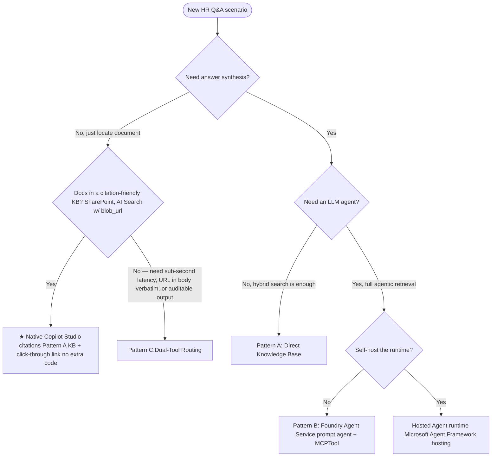

# Retrieval Patterns

This project supports three retrieval patterns plus a Hosted Agent runtime
(Microsoft Agent Framework hosting). Choose one based on **who orchestrates
the search** and **how results reach Copilot Studio**.

> Naming note: "Hosted Agent" here means the **Agent Framework hosting**
> pattern (GA — see [Step 6: Host Your Agent](https://learn.microsoft.com/en-us/agent-framework/get-started/hosting?pivots=programming-language-python)).
> "Prompt Agent" means the **Foundry Agent Service** prompt agent (GA — see
> [Quickstart: Create a prompt agent](https://learn.microsoft.com/en-us/azure/foundry/agents/quickstarts/prompt-agent?tabs=python)).
> Deploying an Agent Framework agent *into* Foundry Agent Service via the
> `agent-framework-foundry-hosting` alpha package is a separate preview surface.

---

## Decision Tree

> **Q3 is about the runtime, not the front door.** Copilot Studio is
> still the front door for both Pattern B and the Hosted Agent — see
> [Hosted Agent wiring](CopilotStudioIntegration.md#hosted-agent-wiring).
> Q3 chooses whether the agent's request loop runs in Foundry
> (Pattern B, managed) or in your container (Hosted Agent,
> self-hosted).

> **Note on the locator branch.** Copilot Studio's native knowledge-source
> citations (SharePoint connector, or Pattern A with `blob_url` /
> `metadata_storage_path` mapped) already give the user a click-through link
> to the source document. Pattern C is the upgrade when you need
> **sub-second latency**, **the URL in the answer body verbatim**,
> **deterministic / auditable output**, or when your source isn't a
> citation-friendly KB. See
> [CopilotStudioLookupRouting.md — Pattern C vs native citations](CopilotStudioLookupRouting.md#pattern-c-vs-native-citations).

---

## Pattern Comparison

| Aspect                | Pattern A — Direct KB ★              | Pattern B — Foundry Agent + MCP      | Pattern C — Dual-Tool Routing              | Hosted Agent (Agent Framework)        |
| --------------------- | ------------------------------------ | ------------------------------------ | ------------------------------------------ | ------------------------------------- |
| **Orchestrator**      | Copilot Studio                       | Foundry Agent Service                | Copilot Studio (router)                    | Agent Framework runtime container      |
| **LLM call**          | None (extractive only)               | Yes (`gpt-4o`)                       | Yes for content; none for lookup           | Yes (`gpt-4o` via FoundryChatClient)  |
| **Search**            | Azure AI Search KB (REST)            | KB MCP tool inside agent             | `/api/lookup` (no LLM) + KB MCP            | Tool: `search_hr_policies` (`@tool`)  |
| **Code path**         | Copilot Studio knowledge action       | `src/agents/hr_policy_agent.py`      | `src/backend/main.py:/api/lookup` + B/A    | `src/hosted_agent/server.py`          |
| **Latency**           | ~1–2 s                               | ~10–14 s                             | ~1–2 s (lookup) / ~10–14 s (answer)        | ~10–14 s                              |
| **Citations**         | Native KB citation card (URL link)   | Inline `[Policy XXXX – Title]`       | Verbatim `blob_url` in answer body         | Inline `[Policy XXXX – Title]`        |
| **Locator answer**    | Click-through citation card           | Click-through citation card           | URL printed verbatim in answer body         | Click-through citation card           |
| **Setup cost**        | Lowest                               | Medium (run `create_foundry_agent`)  | Medium (B/A + Copilot router + REST tool)   | Highest (container deploy)            |
| **Best for**          | "Find me the policy" — native citations cover the link | "Explain how PTO accrues"            | High-volume locator traffic / verbatim URL / deterministic output | Self-hosted runtime, custom auth      |

★ **Default in this repo — start with Pattern A.** Pattern A is the simplest
setup: connect Copilot Studio directly to the Azure AI Search Knowledge
Base. No agent code in this repo runs in the answer path. Upgrade to
Pattern B when you need force-grounded answer synthesis via
`tool_choice="required"`; activate it by setting `AGENT_SERVICE=foundry`
and running `python -m src.agents.create_foundry_agent`.

---

## Pattern A — Direct Knowledge Base

Copilot Studio queries the Azure AI Search Knowledge Base (`hr-knowledge-base`)
directly using its built-in **Knowledge** action. No agent code runs in this
repo for the answering step; this repo only owns the index, skillset, and
knowledge base provisioning.

- **Provision:** `python -m src.agents.create_foundry_agent --skip-agent`
  (creates Knowledge Source + Knowledge Base; skips PromptAgentDefinition)
- **Strengths:** lowest latency, no LLM cost.
- **Limitations:** no answer synthesis — Copilot Studio falls back to
  generative answers using the snippets, which can paraphrase incorrectly.

## Pattern B — Foundry Agent Service + MCPTool

A `PromptAgentDefinition` is published to the Foundry project. Its only
tool is an `MCPTool` pointing at the KB MCP endpoint, with
`tool_choice="required"` so the model is forced to ground every answer in
retrieved policy chunks.

- **Provision:** `python -m src.agents.create_foundry_agent`
- **Code:** `src/agents/hr_policy_agent.py`
- **Invoke:** `openai.responses.create(extra_body={"agent_reference": {...}})`
  via the OpenAI client returned by `project.get_openai_client()`.
- **Strengths:** answer synthesis with strict grounding, single SDK call.
- **Reference:** [Quickstart: Create a prompt agent](https://learn.microsoft.com/en-us/azure/foundry/agents/quickstarts/prompt-agent?tabs=python)

## Pattern C — Dual-Tool Routing

Copilot Studio decides per-turn whether the user wants a **document
location** or a **content explanation**:

- "Where is the PTO policy?" → calls `POST /api/lookup` (no LLM, ~1–2 s)
- "How many PTO hours do I accrue?" → calls Pattern A or B (~10–14 s)

> **When to add Pattern C.** Copilot Studio's native knowledge-source
> citations already surface a click-through link to the source document
> (SharePoint connector, or Pattern A with `blob_url` mapped). Add
> Pattern C only when you need **sub-second latency** on locator
> queries, the **URL in the answer body verbatim** (not in a citation
> footer), **deterministic / auditable output**, or when your source
> isn't a citation-friendly KB. Side-by-side trade-off table:
> [CopilotStudioLookupRouting.md — Pattern C vs native citations](CopilotStudioLookupRouting.md#pattern-c-vs-native-citations).

- **Lookup endpoint:** `src/backend/main.py:/api/lookup`
- **OpenAPI:** `copilot/openapi-lookup-v2.json`
- **Routing guide:** [docs/CopilotStudioLookupRouting.md](CopilotStudioLookupRouting.md)
- **Hybrid example:** [docs/CopilotStudioHybridExample.md](CopilotStudioHybridExample.md)

## Hosted Agent (Microsoft Agent Framework hosting)

A self-contained container that runs `Agent` (Microsoft Agent Framework, GA)
with `FoundryChatClient` and a `@tool search_hr_policies` function. Useful
when you need full control of the runtime (custom auth, side-car services)
or you want to keep the answering loop on your own infrastructure.

- **Code:** `src/agents/hr_policy_agent_af.py`, `src/hosted_agent/server.py`,
  `src/hosted_agent/agent.yaml`
- **Run locally:** `cd src/hosted_agent && uv run python server.py`
- **Deploy:** containerised via `src/hosted_agent/Dockerfile`.
- **Reference:** [Step 6: Host Your Agent](https://learn.microsoft.com/en-us/agent-framework/get-started/hosting?pivots=programming-language-python)
- **Optional preview surface:** deploying the same container *into* Foundry
  Agent Service uses the alpha `agent-framework-foundry-hosting` package —
  see [Hosted agents in Foundry Agent Service (preview)](https://learn.microsoft.com/en-us/azure/foundry/agents/concepts/hosted-agents).

---

## See Also

- [Walkthrough.md](Walkthrough.md) — linear setup walkthrough
- [FoundryAgentArchitecture.md](FoundryAgentArchitecture.md) — Pattern B internals
- [AgentArchitecturePaths.md](AgentArchitecturePaths.md) — Foundry Agent Service vs Microsoft Agent Framework
- [LabCoverage.md](LabCoverage.md) — cross-walk to Azure/Copilot-Studio-and-Azure labs 1.4 / 2.1 / 2.3 / 2.4
- [README.md](../README.md) — top-level walkthrough
- [DataPipelineAndTesting.md](DataPipelineAndTesting.md) — indexing pipeline
- [CopilotStudioIntegration.md](CopilotStudioIntegration.md) — Copilot Studio wiring
