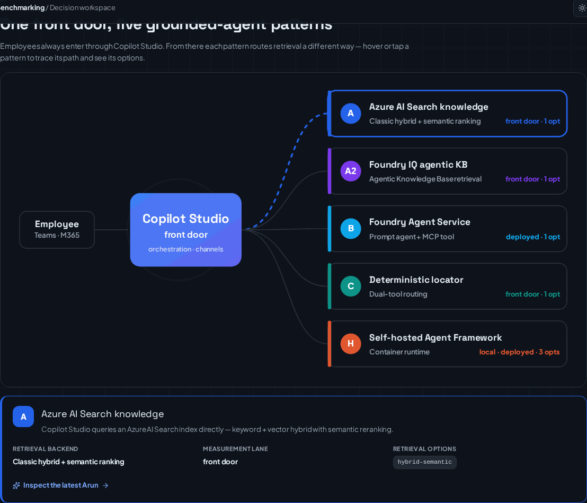

# `src/` — Source Layout

Python packages and the React frontend behind the **Ask HR** sample and the
**Benchmark Workbench**. Start with the top-level [README](../README.md) for the
five retrieval patterns and setup; this file maps the source tree to those
patterns.



## Where each pattern lives

| Pattern (see [RetrievalPatterns.md](../docs/RetrievalPatterns.md)) | Primary source |
| --- | --- |
| **A** — direct Azure AI Search knowledge (classic) | [`search/integrated_vectorization_search.py`](search/integrated_vectorization_search.py); provisioned by [`agents/create_foundry_agent.py`](agents/create_foundry_agent.py) |
| **A2** — Copilot Studio → Foundry IQ (agentic) | Knowledge base from [`agents/create_foundry_agent.py`](agents/create_foundry_agent.py); wired in Copilot Studio (no repo code in the answer path) |
| **B** — Foundry Agent Service prompt agent + MCP | [`agents/hr_policy_agent.py`](agents/hr_policy_agent.py) |
| **C** — deterministic document locator | [`backend/main.py`](backend/main.py) `POST /api/lookup` |
| **Hosted** — Microsoft Agent Framework runtime | [`agents/hr_policy_agent_af.py`](agents/hr_policy_agent_af.py), [`hosted_agent/`](hosted_agent) |

## Packages

| Package | Responsibility |
| --- | --- |
| [`agents/`](agents) | Pattern B prompt agent, the Hosted Agent Framework agent, and Foundry provisioning (knowledge source, knowledge base, MCP connection, prompt agent). |
| [`backend/`](backend) | FastAPI app: `/api/chat`, `/api/lookup` (Pattern C), and the mounted benchmarking API. Also serves the workbench BFF. |
| [`benchmarking/`](benchmarking) | The evidence system — normalized contracts, adapters, runner, aggregation, evaluation, costing, Pareto/SLO decision, and the workbench API. See its [README](benchmarking/README.md). |
| [`config/`](config) | Central configuration: model policy, `search_config.json`, and the fail-closed Azure identity preflight. |
| [`copilot_studio/`](copilot_studio) | Helpers for the Copilot Studio front door (Direct Line, schema/token endpoints). |
| [`document_processing/`](document_processing) | Document extraction/chunking for indexing (Document Intelligence / Content Understanding). |
| [`evaluation/`](evaluation) | Deterministic graders (citation, refusal, locator) and the optional Foundry evaluator integration. |
| [`frontend/`](frontend) | React + TypeScript + Vite **Benchmark Workbench** UI. Screenshots: [docs/images/app/](../docs/images/app/README.md). |
| [`hosted_agent/`](hosted_agent) | Container host for the Agent Framework agent (`server.py`, `agent.yaml`, `Dockerfile`). |
| [`indexing/`](indexing) | Builds/refreshes the shared `hr-policy-index`. |
| [`memory/`](memory) | Conversation/session memory store. |
| [`models/`](models) | Shared data models. |
| [`observability/`](observability) | OpenTelemetry tracing wiring (content recording off by default). |
| [`search/`](search) | Search services: integrated-vectorization classic search and the agentic context provider over the Foundry IQ knowledge base. |

## Run it

```bash
uv sync                       # install
scripts/app.sh start          # backend :8000 + workbench :5174
scripts/app.sh status|logs|stop
```

Naming and product terms follow the top-level README and
[docs/](../docs): **Microsoft Foundry**, **Microsoft Copilot Studio**,
**Azure AI Search**, **Foundry IQ**, **Microsoft Foundry Agent Service**,
**Microsoft Agent Framework**.
