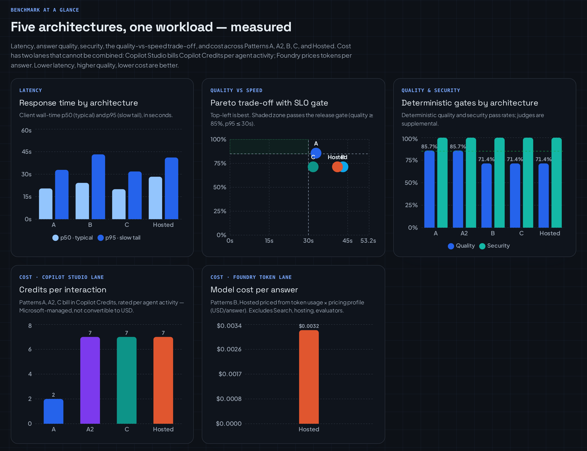

# `src/benchmarking/` — The Evidence System

The reproducible benchmark behind the Part 2 blog draft
([docs/blog/benchmarking-blog-draft.md](../../docs/blog/benchmarking-blog-draft.md)).
It compares the five retrieval patterns without treating controlled experiments,
load tests, and production telemetry as interchangeable evidence. Full design:
[docs/BenchmarkingDecisionSystem.md](../../docs/BenchmarkingDecisionSystem.md).



## Three rules this module enforces

1. **Measure the boundary you ship.** Every run records a
   `measurement_boundary_class`; the front-door boundary (Copilot Studio Direct
   Line) is never subtracted from the deployed-agent boundary.
2. **Two cost lanes that never add up.** Copilot Studio **Credits** and Foundry
   **per-token USD** are estimated on their own meters and never summed. A
   `null` per-token cost on a Copilot Studio run is correct, not missing.
3. **Deterministic gates first, model judges second.** Citation, refusal, and
   locator checks are the release gates; Foundry evaluator judges are
   supplemental and reported alongside, never on top of, them.

## Modules

| File | Role |
| --- | --- |
| [`models.py`](models.py) | Strict versioned contracts: `ExperimentManifest`, `CaseResult`, `AggregateReport` (`schema 1.0`). |
| [`runner.py`](runner.py) | Executes cases through an adapter, times one public boundary, and emits normalized rows. |
| [`adapters/`](adapters) | One adapter per boundary: [`direct_search`](adapters/direct_search.py) (A), [`knowledge_base`](adapters/knowledge_base.py) (A2), [`agent`](adapters/agent.py) (B/Hosted), [`pattern_c`](adapters/pattern_c.py) (C), [`copilot_studio`](adapters/copilot_studio.py) / [`copilot_import`](adapters/copilot_import.py) (front door), [`foundry_hosted`](adapters/foundry_hosted.py). |
| [`activity.py`](activity.py) | Normalizes known retrieval activity; preserves unknown fields losslessly. |
| [`aggregation.py`](aggregation.py) | Deterministic min/max/mean/stdev and p50/p95/p99; cold/warm and reliability accounting. |
| [`evaluation.py`](evaluation.py) | Deterministic quality/security graders, recall@k / MRR, category slices. |
| [`evaluation_attachment.py`](evaluation_attachment.py) | Attaches native Copilot Studio evaluation results to a run. |
| [`costing.py`](costing.py) | Versioned per-token cost from service-reported usage × a dated pricing profile. |
| [`copilot_credits.py`](copilot_credits.py) / [`copilot_credits_cli.py`](copilot_credits_cli.py) | Copilot Credits estimate + reconciliation (the second cost lane). |
| [`copilot_evaluation.py`](copilot_evaluation.py) / [`copilot_evaluation_cli.py`](copilot_evaluation_cli.py) | Drives/imports native Copilot Studio Evaluation runs. |
| [`decision.py`](decision.py) | Pareto membership and SLO qualification; fails closed on missing evidence. |
| [`fingerprinting.py`](fingerprinting.py) | Corpus/index/config fingerprints that gate comparability. |
| [`load.py`](load.py) | Load/capacity contract (`LoadTestReport`); kept separate from sequential percentiles. |
| [`reporting.py`](reporting.py) | Writes manifest + JSONL rows + JSON/Markdown aggregates. |
| [`capabilities.py`](capabilities.py) | Microsoft asset-reuse registry surfaced by the API. |
| [`cli.py`](cli.py) | Run experiments from manifest + cases. |
| [`api/`](api) | FastAPI endpoints powering the workbench (`experiments`, `comparisons`, `decisions`, `patterns/{p}/summary`, `capabilities`, `links`). |

## Run

```bash
# Offline contract smoke — no Azure spend
python -m src.benchmarking.cli \
  --manifest experiments/manifests/synthetic-direct-search.json \
  --cases experiments/datasets/synthetic-migration-smoke.json \
  --fixture-responses experiments/datasets/synthetic-direct-search-responses.json \
  --output-dir experiments/reports/synthetic-direct-search

# Offline contract tests
pytest tests/test_benchmarking_phase1.py -q
```

## Authoritative results

The pinned publication is
[`experiments/reports/decision-system-20260811`](../../experiments/reports/decision-system-20260811)
(commit `9c94215`). Hosted per-mode deterministic quality there is **tool 100%
(7/7), context-semantic 71.4% (5/7), context-agentic 100% (7/7)**, security 100%
across all three, 35 timed invocations each. Front-door (Direct Line) and
component boundaries for A, A2, B, and C live in the same bundle at their own
measurement boundaries. Cite that bundle — not a live screenshot — for published
numbers.

Copilot Studio front-door harness: [docs/CopilotStudioBenchmarking.md](../../docs/CopilotStudioBenchmarking.md).
Load testing: [docs/BenchmarkLoadTesting.md](../../docs/BenchmarkLoadTesting.md).
